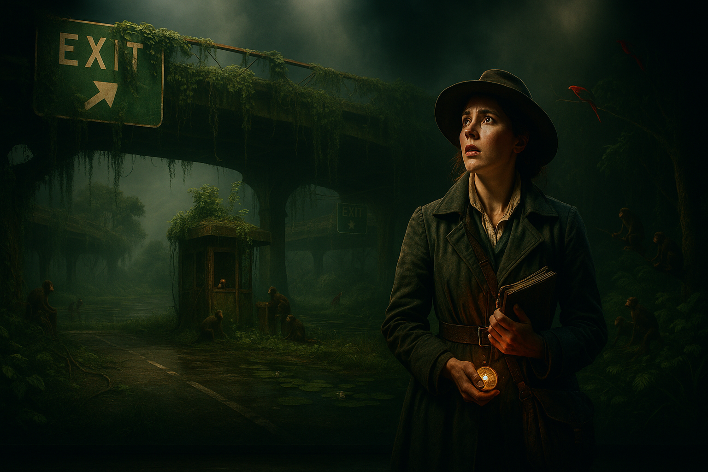
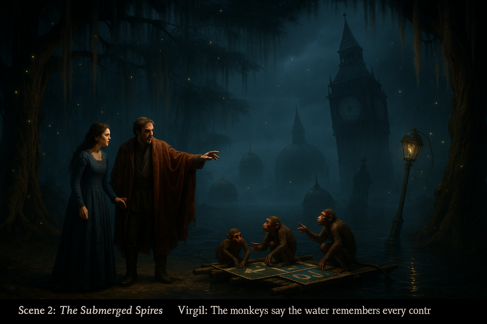
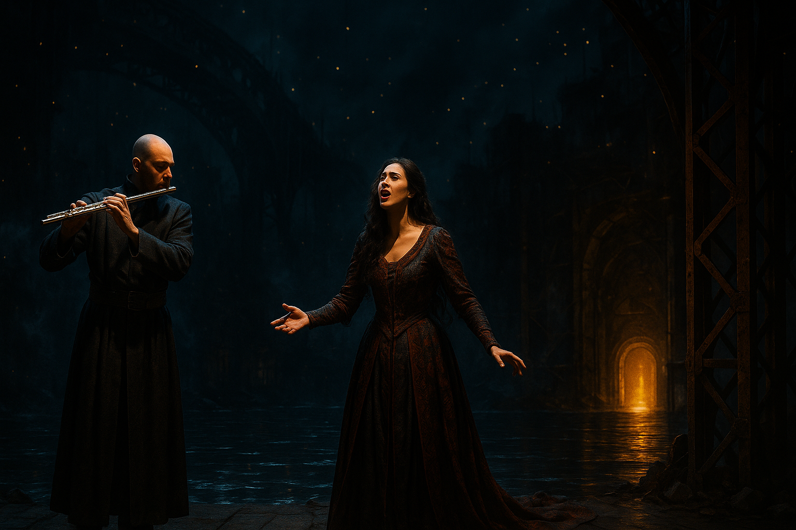
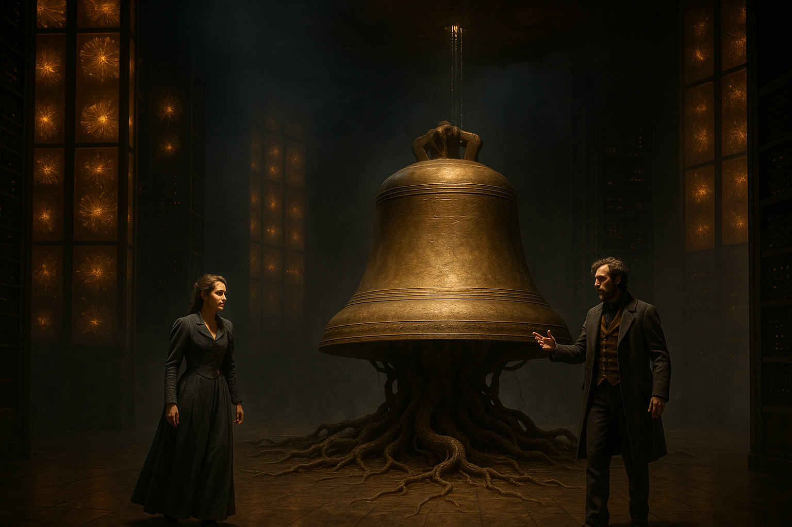
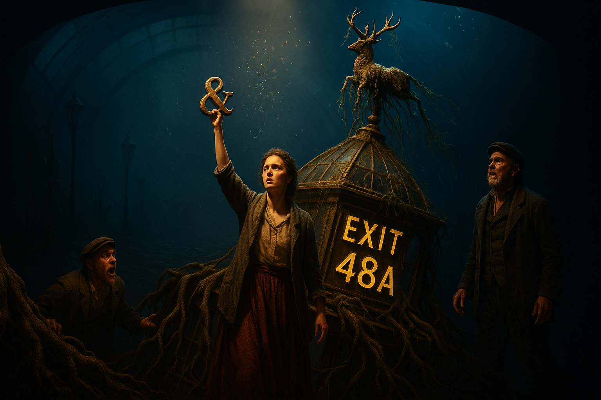
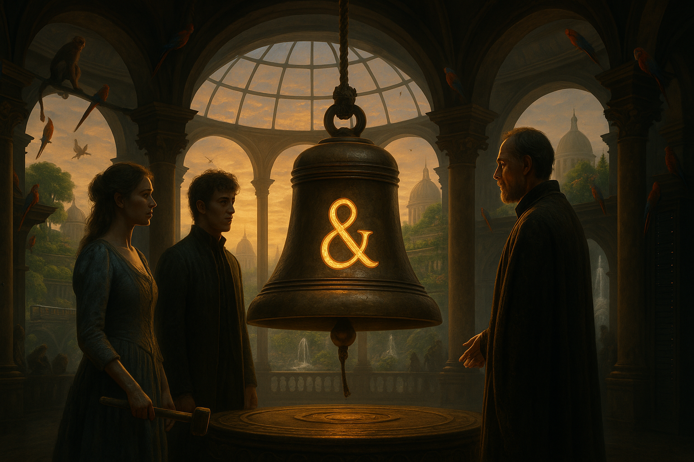

# Iron Aria The Lost City of Hartford

## Premise

They say that all operas are about a soprano
who wants to sleep with the tenor, but the
baritone won't let her. See, for example, La Traviata,
Rigoletto, or Carmen.

You are composing the libretto for such an opera.

The setting is the wild jungles of Connecticut,
in the not-so-distant future after global warming has
reclaimed the land. The soprano is an intrepid
explorer searching for the lost city of Hartford.
The tenor is a native poet who has been living in
the jungle for years, writing sonnets to the trees and
composing symphonies for the monkeys.

The baritone is a government agent who has been sent
to stop the soprano from finding the lost city. He
has a secret weapon: a giant robot that can sing
Verdi arias in three different languages.

The soprano and the tenor meet in the jungle and
fall in love. They decide to join forces and find
the lost city together. But the baritone is always
one step behind them, and his giant robot is getting
closer and closer.

---

### Scene 1: Vines Over the Turnpike

> **Author: GPT-5**

[The stage is a cathedral of green. Overgrown exit signs hang like emerald flags. Kudzu quilts the skeletons of overpasses; saplings sprout from a rusted toll booth. The air is humid, perfumed with wet iron and crushed fern. A river burbles beyond, thick with lily crowns where once the Hartford skyline cut the sky. Cicadas whirr in 12/8. Troupes of clever monkeys clatter old license plates like tiny gongs. High in the canopy, parrots flash insurance-policy colors.]

[Enter Dr. Lyra North, the Soprano—hat brim beaded with dew, a field journal at her breast, a battered compass glowing faintly. She parts the vines with a machete that sings softly when it meets green.]

**Lyra** (soprano):
> O map of lightning in my palm, 
> spin me the way to the city of glass— 
> Hart-ford, heart-forded, 
> where numbers used to sing their solemn psalms, 
> and rain struck ledgers into bells. 
> I tasted your rumor in a storm, 
> I caught your name in the throat of thunder. 
> If I must barter breath for walls, 
> I will, for walls that dream.

[She kneels to read the ground: a palimpsest of hoofprints, raccoon spirals, the ghost of a painted white line. The monkeys hush, as if listening to a story they have heard many times.]

[From the shadows, the Tenor appears: Virgil Ash—barefoot, sun-browned, a garland of lichen draped like laurels. He carries a reed flute and a notebook cobwebbed with vines. He places his hand upon a young oak.]

**Virgil** (tenor):
> My sonnet today is for bark—soft as old letters, 
> brave as a knuckle. 
> You, little oak, are a library of winds. 
> I stitch the gusts to your name with rhyme. 
> Monkeys, keep time; river, write the bass.

[He plays a phrase, and the monkeys answer with syncopated clinks. He notices Lyra. Silence, then the jungle exhales.]

**Lyra** (soprano):
> Who speaks to trees with music?

**Virgil** (tenor):
> A man who owed the city his soul 
> and paid it back to the forest—with interest. 
> You are not a vine, and not a storm. 
> Your boots sang before you did.

**Lyra** (soprano):
> I am searching for Hartford, the lost city. 
> It slept beneath the flood and the foliage, 
> and I carry its dream like a lantern.

**Virgil** (tenor, smiling):
> Hartford slept; I learned its other names: 
> Glass Cathedral, Ledger’s Lantern, Bridge of Bones. 
> I write to trees because they remember the acoustics of its plazas. 
> I write for monkeys because they applaud good enjambment. 
> Will you let the leaves redact your maps?

**Lyra** (soprano):
> I will let them annotate them. 
> Tell me, poet—do you know a door among these vines?

**Virgil** (tenor):
**There are doors that will open only if you speak three tongues** (voice):
> the one the wind hums in the ribs of bridges, 
> the one the water murmurs under cattails, 
> and the one the animals keep in their fast hearts. 
> I can translate the first two. 
> For the third, I have a choir.

[He gestures to the monkeys, who bob and grin.]

**Lyra** (soprano, a laugh unspooling into a melody):
> Then sing with me, translator of green. 
> Walk with me, trespasser of silence. 
> I have a compass that points to questions, 
> and a promise to keep to the future—

**Virgil** (tenor, joining, their lines entwining):
> —And I have sonnets folded like maps, 
> and symphonies for monkeys that spell “home.” 
> Let us find the city together. 
> Let us wake its bells from the riverbed.

[Duet: They circle each other in widening rings, voices threading like vines.]

**Lyra and Virgil** (soprano):
> Two needles of one compass, 
> two paths that braid to one road. 
> Under the ivy, under the water, 
> there is a room with our names in dust. 
> We will brush it clean with breath. 
> We will barter songs for stones. 
> Hart-ford, heart-forded— 
> we are your echo returning.

[The monkeys echo the last word in bright chatter. The parrots cast down a mosaic of light.]

[Far off, beyond the trees, a deep metallic resonance rolls like thunder. It resolves into a perfect Verdian cadence, then fractures and is answered—in another tongue, then another. The leaves tremble, aware.]

[A silhouette crosses the highest canopy: a crane-arm, or a throat that opens and closes, lit from within. Birds go still. Somewhere, a boot grinds on gravel with bureaucratic patience.]

Offstage Voice of Agent Calder, the Baritone (distant, dry as a decree):
Keep your coordinates. Keep your courage.
Keep out.

[The cadence returns—three languages, three iron flowers of sound. The giant thing far away warms its voice. Lyra and Virgil look at each other; fear and laughter shake hands.]

**Lyra** (soprano, softly, resolute):
> One step ahead.

**Virgil** (tenor, matching):
> Before the machine learns the syllables of our names.

[They take each other’s hands. The monkeys form a procession with license-plate bells. The jungle rearranges itself into a narrow, promising corridor—toward the river, toward the drowned piers and the rumor of a steeple caught in the reeds.]

[They go. The wind lifts a stray page from Virgil’s book; it catches on a branch. The stage darkens to the heartbeat of distant machinery and the bright, stubborn pulse of two voices weaving a path through green.]

---

### Scene 2: The Submerged Spires

> **Author: Claude Opus 4.1**

[The river's edge. Twilight filters through Spanish moss that drapes from towering sycamores. The water is glass-dark, disturbed only by the occasional surfacing of a copper dome or the tip of a clock tower frozen at 3:47. Fireflies pulse in algorithmic patterns, as if reciting old insurance codes. A broken streetlamp, half-submerged, flickers with bioluminescent algae.]

[Lyra and Virgil stand at the shore. The monkeys have fashioned a raft from highway signs and sealed it with pine resin. They chatter nervously, pointing at the water.]

**Virgil** (tenor):
> The monkeys say the water remembers 
> every contract ever signed above it. 
> Listen—it whispers in legalese, 
> bubbles burst in whereas and therefore.

**Lyra** (soprano, testing the water with her compass):
> My needle spins like a dancer 
> who has forgotten which way is home. 
> The city's magnetic heart still beats 
> beneath these acres of forgetting.

[She produces a diving bell improvised from a shopping cart and car windows, sealed with vines.]

**Virgil** (tenor):
> You would descend into the archive of floods? 
> The water here speaks three dialects of drowning.

**Lyra** (soprano):
> Then I will learn them all. 
> Hartford keeps its promise underwater— 
> I can taste its copper in the current.

[A tremendous mechanical harmony rings out, closer now. Through the trees, glimpses of metal catching moonlight. The giant robot's voice echoes across the water in perfect Italian, then German, then French—fragments of "Di quella pira," "In fernem Land," "Ah! lève-toi, soleil!"]

[Enter Agent Calder, the Baritone—crisp despite the humidity, wearing the remnants of a federal suit patched with kevlar and moss-proof coating. Behind him, partially visible through the trees, the Giant Robot ARIA-7 extends to three stories, its throat a cascade of brass pipes, its eyes projection screens showing spreadsheets of extinct species.]

**Calder** (baritone):
> Dr. North. Your permits expired with the world 
> that issued them. Turn back. 
> The city you seek is classified 
> beneath tons of water and Executive Order 10999.

**Lyra** (soprano):
> Orders written on water, Agent Calder. 
> Show me the bureau that governs dreams.

**Calder** (baritone):
> Dreams are regulated under Section Five. 
[He gestures; ARIA-7 steps forward, each footfall a percussion.]
My companion speaks the only law that matters now—
harmony that could shatter your bones,
melody that freezes blood in its branches.
ARIA-7, demonstrate.

[The robot sings a phrase that makes the water tremble and recede. Fish rise, stunned, to the surface.]

**Virgil** (tenor, to Calder):
> Your machine sings beautifully 
> of nothing. My monkeys know more 
> about music—they understand silence.

**Calder** (baritone):
> Silence is what I offer you. 
> Walk away. Write your little poems 
> to trees that don't read. 
> Leave the past where it drowned.

**Lyra** (soprano):
> The past isn't drowned—it's diving. 
> Watch me follow it down.

[She begins to enter the diving bell. Virgil catches her hand.]

**Virgil** (tenor):
> Wait—I've been composing something. 
> A song that makes the water clear, 
> that parts the murk like curtains. 
[To his monkeys] Movement three, remember?
The one we practiced for the rain?

[The monkeys arrange themselves in a circle. Virgil raises his flute. They begin a complex rhythm with their license plates while Virgil plays—the music seems to crystallize the water, making windows in its surface.]

[Through these windows: glimpses of Hartford below. Street signs wave like kelp. A cathedral's rose window glows with phosphorescent fish. And there—a golden door, still sealed, barnacled with light.]

**Lyra** (soprano, triumphant):
> There! The repository! The seed vault 
> where they stored the city's memory!

**Calder** (baritone, commanding):
> ARIA-7—Code Verdi, full volume! 
> Drown their little tune!

[The robot begins the "Anvil Chorus," but sung in three languages simultaneously. The sound is overwhelming. The water begins to churn and rise.]

[Lyra and Virgil sing together, their melody weaving through the robot's massive harmonies like silver

---

### Scene 3: A Key of Three Breaths

> **Author: GPT-5**

[The river is a black mirror latticed with windows of song. Where Virgil’s flute and the monkeys’ bright metal rhythms touch the surface, panes of clarity hold, showing the drowned avenues below. The golden door glows beneath, a lighthouse turned horizontal. ARIA-7’s chords hammer the shoreline; each vowel is a wave; each consonant, a shock of spray. The rusted ribs of an old overpass vibrate like a cathedral organ. Fireflies redraw constellations to a new tempo.]

[Lyra and Virgil stand at the brink, their duet threading through the machine’s thunder like silver filament through a loom of steel.]

**Lyra** (soprano):
> Hold the pitch—hold me—hold the window. 
> I see letters sleeping in their cases, 
> ledgers curled like nautilus, 
> and there—gold with stubborn breath, 
> the door that kept the city’s seed.

**Virgil** (tenor):
**We have two tongues in our mouths already** (voice):
> water that remembers, animals that forgive. 
> What about the wind, Lyra? 
> We must ask the bridge to exhale its story.

[He points to the tilted overpass: a ribcage of iron. A low gust shivers the ivy. The parrots fall silent, as if making room.]

**Calder** (baritone, advancing, voice cut from statute):
> No more stories. Close your pages. 
> ARIA-7, flood their frequencies. Null their noise.

[ARIA-7 steps forward; bellows open like brass flowers. Its tri-lingual Verdi blooms, a legal sunrise of sound. The monkeys cringe, but do not drop their beat. Virgil runs up the slanted skeleton, bare feet quick on rust, and lifts his reed flute into the draft.]

**Virgil** (tenor):
> Bridge, lend me a lung. 
> Give me the wind that haunted your trusses— 
> the language of traffic and winter. 
> I will frame your breath with rhyme.

[He plays, but the gusts are thin. Lyra holds up her compass; its needle hums, pulls at the air.]

**Lyra** (soprano):
> Needle that knows north of the heart, 
> tune this gust to golden hinges. 
> Come, wind—speak in the ribs, 
> speak in the ribs!

[ARIA-7’s cooling fans surge; Calder snaps a hand to cut power, but the machine must breathe. A clean current pours from its grills—an accidental mercy. The bridge catches it; iron sings. Virgil answers, matching overtones, weaving the wind’s rough song into his.]

**Monkeys** (voice, a ringed ostinato, bright and defiant):
> Clink-clink, heart-ford, clink-clink, heart-ford.

[The water-windows widen. The golden door brightens; barnacles of light begin to release with soft, pearly pops.]

**Calder** (baritone, to ARIA-7, terse):
> Override. Mask. Mask!

[ARIA-7 shifts keys, sings a burr of vowels in three tongues that vibrates the bones of trees. Still, the bridge’s wind-voice has been found. Lyra steps to the edge and sings a high, clear thread that rests exactly where wind and water kiss.]

**Lyra** (soprano):
> Third tongue, join the second, join the first. 
> Unseal the noun that means return.

[Below, the golden door grows a seam—thin as a vein at first, then a smiling wound. Bubbles rise like archived sighs released.]

**Virgil** (tenor, to Lyra, fervent):
> Now—before the law remembers our names.

**Lyra** (soprano, to the monkeys):
> Keep the bridge breathing. Hold the window. 
> If it closes, sing harder.

[She touches the brow of the nearest monkey; it grins, brave as a drum. Lyra and Virgil step into the water-window as if through glass—no splash, just the slow glide of a dream choosing to be true.]

**Calder** (baritone, surging forward):
> No further.

[He flings his baritone in a blade of command. ARIA-7 answers with a colossal cadenza that tilts the raft; plates skitter; a sapling snaps. The water panics—but the window holds where the monkeys keep time, and where the bridge hums its newly freed note.]

**Virgil** (tenor, turning back one breath, to Calder):
> Agent—hear it? Your machine gave us wind. 
> Even your law cannot outlaw an accident of mercy.

**Calder** (baritone):
> Mercy is not a clause I recognize.

[He produces a fist-sized beacon, a cold blue. He slaps it onto the glowing seam; it adheres with a bureaucratic click, sending a lattice of coordinates through the water.]

**Calder** (baritone, to ARIA-7):
> Mark this aperture. Prepare retrieval. 
> If they enter, we audit the city itself.

[Lyra and Virgil slip below. The golden seam widens to receive them. Their voices, now muffled, braid with the subterranean bells.]

[Underwater tableau visible through the window: aisles of glass jars with seeds like sleeping constellations; servers’ spines lit with slow green; a bronze bell sunk in a cradle of ferns. In faint letters on a wall: Archivum Cordis.]

**Lyra** (soprano, from within, awed):
> The Archive of the Heart—Virgil, do you see? 
> A city’s pulse saved in envelopes of light.

**Virgil** (tenor):
> And somewhere deeper, a bell that could re-time the river, 
> retune iron throats, teach machines to dream of leaves.

[The golden door, obeying the three tongues, slides shut on a breath. The last thing visible: Lyra’s compass, gleaming like a small moon, and Virgil’s hand catching hers. Then—sealed.]

[Above, the windows shatter back into dark water. The monkeys’ rhythm falters, then steadies into a watchful, low chant. Calder stands, rain of algae on his shoulders, jaw set.]

**Calder** (baritone):
> So be it. 
> If they burrow into the heart, 
> we will cut the arteries. 
> ARIA-7, summon weather from your lungs. 
> Call the river’s debt.

[ARIA-7 inhales, its lantern-eyes flickering with maps. The parrots explode upward, a signal. The bridge hums, now allied with something beneath. Distant inside the Archive, a responding tone—an ancient, patient chord—awakens, promising corridors and trials.]

[Lights draw down to a deeper green. The stage splits by suggestion: above—the agent and his obedient thunder; below—Lyra and Virgil’s silhouettes entering the honeycombed halls. Between them, the golden seam, now a thin, electric memory, etched with Calder’s blue beacon.]

[The monkeys gather at the shore like a temple guard, license plates held close to chests. One lifts a plate stamped with CONNECTICUT and kisses the word quietly.]

**Monkeys** (voice, soft, prophetic):
> Hart-ford, heart-forded— 
> hold their breath. Hold their names.

[Blackout to the pulse of two realms answering each other, as the opera turns inward.]

---

### Scene 4: The Cabinet of Echoes

> **Author: Claude Opus 4.1**

[The Archive's inner chamber. Walls of amber glass hold suspended seeds like frozen fireworks. Server towers hum lullabies in obsolete code. At the center: a bronze bell large as a room, cradled in roots that have grown through the floor. Its surface bears the inscriptions of every insurance policy ever honored, every municipal promise kept. Water drips through the ceiling in metronomic patience, each drop a liquid note.]

[Lyra and Virgil move through aisles of memory. Her compass pulls toward the bell; his fingers trace the spines of data like a blind reader finding braille.]

**Virgil** (tenor):
> These servers dream in FORTRAN and COBOL— 
> languages that sang before we learned to lie. 
> Listen: they're composing elegies 
> for spreadsheets, for the dignity of digits.

**Lyra** (soprano, approaching the bell):
> This bronze remembers when it rang for births, 
> for deaths, for the beginning of the workday. 
> If we wake it now, will it remember how to sing 
> for something that hasn't happened yet?

[She strikes the bell gently with her compass. A low tone spreads like honey through water. The servers brighten; seeds stir in their jars.]

[Above, through the ceiling's transparency: Calder paces the shore. ARIA-7 has begun to drink the river, pulling water through its mighty pumps, preparing to drain the Archive's protection.]

**Calder** (baritone, his voice filtering down, inevitable):
> Dr. North, you've found the city's heart. 
> Now watch me stop it beating. 
> ARIA-7—begin extraction protocol. 
> Empty their sanctuary drop by drop.

[The water level visible through the walls begins to recede. Fish flee downward. The Archive groans.]

**Virgil** (tenor):
> He's stealing our ocean, our armor of forgetting. 
> Soon this place will gasp like a landed fish.

**Lyra** (soprano):
> Then we must make the bell sing now— 
> sing Hartford back to the surface, 
> sing memory into muscle and bone.

[She examines the bell's inscriptions, finds a keyhole shaped like an ampersand.]

**Lyra** (soprano):
> It needs a key—not metal, but melody. 
> A song that knows both loss and finding.

**Virgil** (tenor):
> I've been writing one for seventeen years, 
> waiting for someone who'd understand the bridge. 
> It goes like this—

[He begins to sing—a simple melody that builds in complexity, each verse adding a harmony line. The monkeys above, sensing the song through the water, begin their accompaniment. The bell resonates.]

[ARIA-7's extraction accelerates. Water rushes away from the walls. The Archive's lights flicker between green and gold and panicked red.]

[Through a window in the floor: a deeper chamber revealed as water retreats. Hundreds of smaller bells nested like shells, each holding a different decade's echo.]

**Lyra** (soprano, urgent, improvising harmony):
> The nest of bells—Virgil, look! 
> The city saved its voice in octaves. 
> If we wake them all at once—

**Virgil** (tenor):
> —we wake the city itself. 
> But our lungs against that machine above?

[They hear ARIA-7 beginning Verdi's "Dies Irae" in three languages, the sound so powerful it cracks the amber walls. Seeds begin to spill.]

**Lyra** (soprano):
> Not our lungs alone— 
[She opens a server panel, speaks to the circuits]
You who remember every transaction,
every small promise kept in rain—
sing with us. Add your frequency
to this unfinished psalm.

[The servers respond—a choir of electrical hymns, zeros and ones becoming notes. The bell begins to glow.]

**Virgil** (tenor, to the spilling seeds):
> You too—dreams of corn and maple— 
> lend us your sleeping green notes. 
> Remember the music of becoming.

[The seeds emit a subsonic hum, the sound of potential energy converting to kinetic hope. The smaller bells begin to wake, each adding its decade:]

**Bells** (voice, staggered, building):
> 1950s: Highway hymns and factory time... 
> 1980s: Digital dawn, magnetic tape... 
> 2010s: The last spring before the water... 
> 2040s: When we learned to swim in our old streets...

[Above, Calder commands ARIA-7 to sing louder, but the robot's cooling systems are overtaxing. Its voice, magnificent and terrible, begins to crack between languages.]

**Calder** (baritone):

---

### Scene 5: Ampersand Rising

> **Author: GPT-5**

[The bell exhales. The Archive shivers like a lung choosing to breathe. A column of bubbles whirls upward, taking with it seeds that glitter like constellations shaken from a jar. Roots tighten their grip on bronze and glass; then, with the slow certainty of a tide reversing, everything begins to lift.]

[Above, the river arches like a glass spine. Streetlamps peel themselves from cattails. A gilded weathervane in the shape of a stag breaks the surface, antlers streaming algae like silk. EXIT 48A emerges, its letters gleaming as if newly minted by rain. The monkeys hoot, stunned, then beat time with license plates as if welcoming a ship.]

[ARIA-7 staggers as the water it drank becomes a fountain inside it. Its brass flowers splay open; steam rises, scented with wet copper. It searches for a key; finds only the bell's pitch, which leaks into its algorithms like light through a ledger’s tear.]

**Calder** (baritone, braced against the lurching world, voice flint and weather):
> Hold your line, ARIA-7. 
> Counter-signal. Code Nabucco—tri-lingual. 
> Lock them under law.

[ARIA-7 obeys, tectonic voice unfurling “Va, pensiero,” at once in Italian, German, French: a lattice of yearning remade as warning. The sound tries to nail the rising structures back into water. The air vibrates with the impossible chord.]

[Below, Lyra and Virgil ride a helical lift of roots and light, spiraling through the Archive’s throat. The servers surge beside them like a school of lit fish. Each level they pass releases a chorus: the bells of decades, the slow hum of seeds, the wind archived in iron.]

**Lyra** (soprano, her hand on the bronze, singing into its grain):
> We rise not to undo the green, 
> but to braid it with the stone. 
> Hart-ford, heart-unforded— 
> be harbor and be home.

**Virgil** (tenor):
**Let the contract be amended** (voice):
> one city, signed by river, 
> cosigned by trees, witnessed by wind. 
> Bell, become not war but weather.

[The blue beacon Calder slapped to the seam flickers, trying to fix coordinates on a moving heart. Lyra plucks it as they pass; it hums a cold tone. She presses it to the bell’s ampersand. The symbol drinks the color, turns the beacon’s audit into a signature that blooms like lichen.]

**Lyra** (soprano, to the beacon, gentle):
> From mark to meaning. 
> From capture to consent.

[They break the surface into a rotunda hollowed by time: the Old State House, its columns braided with wisteria and hydrangea. The bronze bell rises through the floor as if it were always meant to be there; water sheds from it in veils. Above, the river hovers, a suspended ceiling; fish swim through sunbeams across the dome.]

[The monkeys pour in, forming an orchestra in the galleries. Parrots arrange themselves on the cornices like stained glass that chose to perch. Servers bloom across the walls, their fans turning like prayer wheels. At one broken window, the bridge leans in, ribs humming.]

[ARIA-7 lumbers into the rotunda’s far arch, enormous, steaming, its eyes flickering spreadsheets that glitch into leaves and back again. Calder enters below its arm, soaked to the bones, badge dulled by silt.]

**Calder** (baritone):
> Dr. North. Mr. Ash. 
> This is a felony writ in floodlights. 
> Stand down. Let the river close.

**Lyra** (soprano, turning to him, not defiant but inviting):
> Agent Calder, the city you love is not a hazard. 
> It is a memory asking to become a promise. 
> Sing with us its new name.

**Calder** (baritone, bitter, but cracked by the bell’s glow):
> Names do not hold back water. 
> I named my son, and the river took him anyway.

**Virgil** (tenor):
> Water is a singer, not a thief. 
> Hear it now—how it wants to carry, not erase. 
> Lend it your baritone and it will obey the shape you give it.

[ARIA-7’s tri-lingual Verdi splinters, then coalesces around a new overtone—the bell’s. The machine, confused, begins to harmonize by accident, creating a fourth tongue neither court nor forest has heard: leafcode, algorithm and rust.]

ARIA-7 (tentative, resonant):
Data…dare…dare affidamento…Vertrauen…confiance…
[It hums the ampersand, the & becoming a bridge in sound.]

[Calder looks up at his machine—at its attempt to learn trust. The badge on his chest grows heavy. He tears it off. It falls, rings once on the marble, becomes a small, obedient silence.]

**Calder** (baritone, to the bell, unarmored):
> If you will have me, let me speak my clauses true. 
> I will be the necessary “and” between flood and field. 
> I will enforce this covenant with my own breath.

[He steps to Lyra and Virgil. The three stand as corners of a triangle around the bell. The monkeys hush, waiting. The wind in the bridge waits. The servers hold their tone like held light.]

**Lyra** (soprano):
> Three tongues, three breaths. 
> Agent, take the wind—your voice knows command. 
> Virgil, take the water—your voice knows surrender. 
> I will take the animals—their pulse is my pitch.

**Virgil** (tenor, smiling through tears):
> And all of us will take the bell.

[They begin. Calder shapes the draft into law that bends toward mercy. Virgil pours the river through vowels that forgive. Lyra threads the heartbeat of a hundred small chests. The bell answers, not with a strike, but with a continuous tone that deepens until the dome itself trembles.]

[Outside, Hartford lifts its face. Stoops shrug off algae and grow moss like velvet. Marble lions shake water from manes and root their paws in soil sprouting from cracks. The golden door they opened below reappears as a plaza fountain, ringed by saplings. Street names return slowly, like commas: Asylum, Trumbull, Pratt—each letter green with the future.]

[ARIA-7, drawn now, folds its massive knees and kneels, its brass throat set to receive the bell’s teaching. It sings snatches of “Ritorna vincitor!” in three languages, but now the victory it envisions is return itself: the city to itself, the agent to his better oath.]

ARIA-7 (softening, learning):
Ritorna…wiederkehren…retourner…
non come prima…als anders…autrement.

[Calder’s face breaks; he is crying, as if the act itself were an amendment. He sings his son’s name without words, and it becomes the new river’s left bank.]

**Calder** (baritone):
> By breath and bracket, 
> by flood and field, 
> I sign.

[The bell’s ampersand flares—two curls clasping. The servers flash CONSENTACCORD in antique fonts. The monkeys throw their plates into the air and catch them on beat; the parrots scatter confetti of petals ripped from flowers that seem eager to donate them.]

[But the work is not yet done. The hovering river trembles; gravity clears its throat. The city will either settle into its new ecology or be crushed by its own rising if the tone wavers.]

**Lyra** (soprano, suddenly faint, spent):
> Hold—hold—my note is fraying—

**Virgil** (tenor, taking her hand, lending breath):
> Take mine. Take all of it.

[Calder braces them, shoulders beneath their voices like a beam under a roof.]

**Calder** (baritone):
> ARIA-7, sustain. Attend. Learn the rest.

[The machine opens its full register at last, not to overpower but to undergird. It becomes a pedal point of brass and kindness.]

ARIA-7:
Sub-tendere. Under-stand.

[In the galleries, a single monkey steps forward—a small, elder creature with a scar over one eye. It taps a plate three times, then lays it on the marble. The plate reads CONNECTICUT. It bows to the bell as if to a throne, then joins the circle again.]

**Monkeys** (voice, low, unanimous, a vow):
> Hart-ford, heart-unforded— 
> we keep this beat.

[The tone holds. Outside, the river settles into canals and cuffs engraved with sedges. The bridge sighs and lowers its ribs, an old beast agreeing to carry new weight. Light clarifies.]

[Lyra, Virgil, and Calder stand, their breaths braided, their faces lit by the ampersand’s glow. They look to one another, to the bell, to the city that has chosen to live differently.]

[From far off, thunder without weather: the sound of institutions turning in their sleep. A dossier of distant laws rattles. Something old is waking to argue.]

**Calder** (baritone, quietly, to the others):
> They will come.

**Lyra** (soprano):
> Then we will have our charter ready.

**Virgil** (tenor):
> And our chorus.

[They gather themselves for the final articulation—the strike that will fix the covenant, imprint it upon marble and mycelium, encode it in servers and sap. The mallet hangs ready—a simple length of river-worn oak. The bell waits.]

[Blackout on the poised mallet, the ampersand bright as a sunrise between two hands.]

---

### Scene 6: The Marriage of Maps

> **Author: Claude Opus 4.1**

[Dawn through the dome. The rotunda has become a parliament of species: monkeys in the galleries, parrots on the cornices, servers humming along the walls like a chorus of electric monks. The bronze bell stands at center, its ampersand glowing with the patient light of contracts honored. Hartford spreads beyond the arches—a city of terraces where buildings wear gardens like green collars, where trolleys run on tracks of moss, where fountains speak in the dialect of rain.]

[Lyra holds the mallet. Virgil stands beside her, their hands almost touching. Calder faces them across the bell. ARIA-7 kneels at the threshold, its brass throat open to receive whatever song comes next.]

[Enter, through the great doors: a Delegation of the Old Order. Three figures in suits that remember dryness, carrying briefcases of precedent. Their leader holds a subpoena that smolders at the edges.]

**Delegate** (voice):
> By authority vested in the previous world, 
> we declare this resurrection null. 
> Cities that drown must stay drowned. 
> The actuarial tables demand it.

**Calder** (baritone, stepping forward, his baritone now a bridge):
> I was your agent once. I know your tables. 
> But tables float, given enough water. 
> Given enough love, even laws learn to swim.

**Delegate** (voice):
> Agent Calder, you are relieved of duty. 
> ARIA-7, return to protocol. 
> Resume enforcement.

[ARIA-7 rises slowly, joints singing. It looks to the Delegates, then to Calder, then to the bell. Its eyes flicker between spreadsheets and the soft green light of the ampersand.]

ARIA-7 (in all three languages at once, then resolving to one clear voice):
I have learned a fourth tongue.
It speaks in seeds and circuits together.
**My protocol is now the covenant of keeping** (voice):
> keep the green, keep the stone, 
> keep the promise between them.

[The Delegates raise their subpoena. It bursts into flame—not destroying, but revealing words written in fire beneath the litigation: "Let the city choose its shape."]

**Virgil** (tenor, to the Delegates):
> Your own deep law agrees. 
> Even paper wants to return to trees.

[The lead Delegate opens his briefcase. Inside: not writs but seeds—thousands of them, saved from the old world, waiting.]

**Delegate** (voice, voice breaking from statute to human):
> We saved these. We couldn't bear to let them drown. 
> Plant them in your ampersand city. 
> Teach us the new amendments.

**Lyra** (soprano):
> Then witness this: the marriage of maps. 
> One drawn in water, one in root, 
> joined by the vow of those who'll tend them.

[She raises the mallet. Looks to Virgil.]

**Lyra** (soprano):
> Virgil Ash, poet of the in-between, 
> will you write this city with me? 
> Will you translate my compass points to poems, 
> my straight lines to your spirals?

**Virgil** (tenor, taking her free hand):
> Lyra North, dr. of finding and founding, 
> I will. I'll write sonnets to your science, 
> symphonies to your systems. 
> Together we'll annotate the afternoon, 
> footnote the river, make margin notes in leaves.

[They strike the bell together. The sound is enormous—not loud but deep, traveling through bronze and bone, through circuits and sap, through the watching hearts of monkeys and the memory banks of servers.]

[The ampersand flares and multiplies—suddenly every surface bears the symbol: & between brick & vine, water & bridge, law & music. The city inhales its new grammar.]

[The Delegates remove their dry suits, revealing clothes stained with pollen and river silt. They had been walking the margins all along, waiting for permission to belong.]

**Calder** (baritone, to ARIA-7):
> Old friend, new teacher— 
> sing us into our work.

[ARIA-7 begins a new aria—not Verdi but its own composition, woven from the three languages plus the fourth tongue of becoming. The monkeys accompany with their bright percussion. The parrots echo in harmonies that sound like wind chimes made of light.]

ARIA-7 & Chorus:
**This is the charter of the ampersand** (voice):
> Between the drowned & found, 
> Between the grown & built, 
> Between the law & lawn, 
> We sign ourselves to tend.

Hartford, heart-ford, crossing

---

