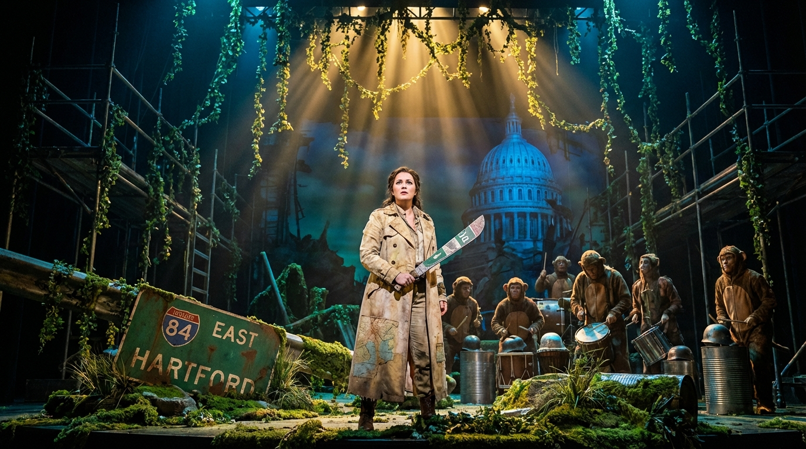
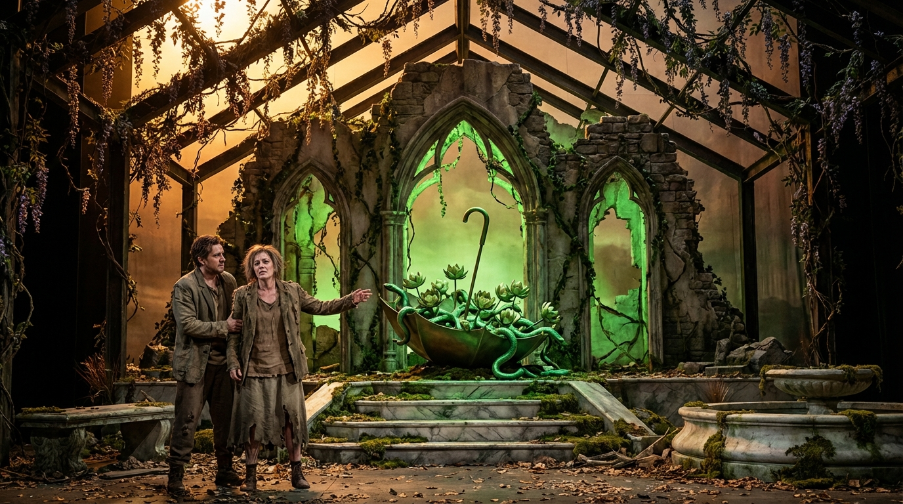
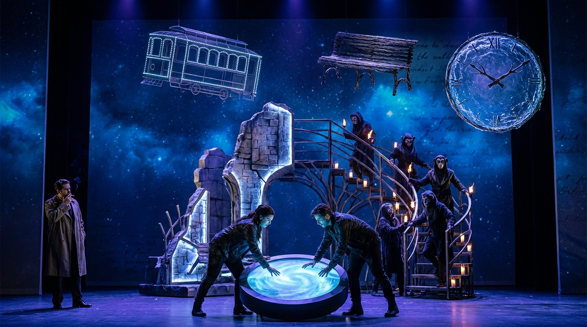

# Vines of Hartford, Arias of Steel

## Premise

They say that all operas are about a soprano
who wants to sleep with the tenor, but the
baritone won't let her. See, for example, La Traviata,
Rigoletto, or Carmen.

You are composing the libretto for such an opera.

The setting is the wild jungles of Connecticut,
in the not-so-distant future after global warming has
reclaimed the land. The soprano is an intrepid
explorer searching for the lost city of Hartford.
The tenor is a native poet who has been living in
the jungle for years, writing sonnets to the trees and
composing symphonies for the monkeys.

The baritone is a government agent who has been sent
to stop the soprano from finding the lost city. He
has a secret weapon: a giant robot that can sing
Verdi arias in three different languages.

The soprano and the tenor meet in the jungle and
fall in love. They decide to join forces and find
the lost city together. But the baritone is always
one step behind them, and his giant robot is getting
closer and closer.

---

### Scene 1: The Charter Oak Awakes

> **Author: GPT-5.2**

[The stage is a steaming green cathedral. Vines drape the ribs of a collapsed highway sign: I-84 EAST—HARTFORD. The dome of a distant ruined building glints blue beneath strangler figs. Sunlight breaks in lances. A thousand leaves whisper like a rusted chorus. The air shades to emerald as cicadas and a CHORUS OF MONKEYS (CHORUS) patter rhythms on hollowed helmets and soda cans half-buried in moss.]

[Enter, cutting through creepers with a machete fashioned from a road sign, ELARA, SOPRANO. She wears a sun-bleached explorer’s coat patched with nautical charts; a compass pendant beats against her throat like a pulse.]

ELARA, SOPRANO:
O river that forgot your name in vines,
O avenue of maples swallowing the lanes—
I have followed steam and rumor, broken codes
in lichened masonry the ivy keeps.
Hartford, ghost of ledgers and blue domes,
let me find your heart before my own falls quiet.
Mother, you said the city sleeps inside the trees—
wake with me now.

[She unrolls a weather-cracked map; a traced line trembles. The CHORUS OF MONKEYS answers in squeaks like muted pizzicati.]

**ELARA** (voice):
> Cavatina—“Chart of the Green” 
> Where boulevards once braided rivers, 
> now the rivers braid the streets; 
> the compass spins in leaflight, 
> but my longing points due east. 
> Hartford, Hartford, lost and listening, 
> raise your clock of buried chimes; 
> if I must make love to danger, 
> I will marry all your vines.

[A rustle from above. A figure descends on a net of lianas, bare feet touching the rotten balustrade of an overpass with the grace of rain. He carries a bound book stitched with bark.]

ARDEN, TENOR:
No blade, stranger—your breath already cuts.

[He leaps softly to earth.]

ARDEN, TENOR:
I heard a longing move the understory,
a needle drawing wind into a seam.
Who calls a city by its sleep-name here?

**ELARA** (voice):
> I am Elara—maps for blood, storms for kin. 
> And you?

**ARDEN** (voice):
> Arden. I gave my calendar to the mangoes. 
> I write sonnets for the sycamore 
> and symphonies the macaques keep in time. 
> This ruin is my orchestra; the rain is first chair. 
> Who taught you Hartford’s secret syllable?

**ELARA** (voice):
> A lullaby of ledger paper, when the tides came in. 
> A cistern of stories. I have a promise 
> to pull a city out of its green cocoon.

**ARDEN** (voice):
> Then listen—Arietta to the Canopy. 
[He raises his book; the CHORUS OF MONKEYS gathers, beating gentle cross-rhythms.]

**ARDEN** (voice):
> The oak that hid a charter hides a clock, 
> its pendulum a heron’s speechless neck; 
> the armory dome, a blueberry cupped 
> in hands of moss—its echo keeps the key. 
> I have named every root between us and that bell. 
> But naming is not entering.

**ELARA** (voice):
> And entering is not surviving. 
> Help me cross; be my guide.

**ARDEN** (voice):
> If I take your hand I plant a flag in hazard. 
> If I let it go, I orphan my own breath. 
> Your eyes are maps that burn.

**ELARA** (voice):
> Your voice is shade; I want to sleep in it.

[They step closer. Light narrows. A tender hush. The first tremor of a motif binds them.]

DUETINO—“Two Compasses”
**ELARA** (voice):
> You point to poems; I point to stone. 
> Together—

**ARDEN** (voice):
> —we may point to home.

**BOTH** (voice):
> Let dream and street be braided, 
> let tongue and road align; 
> we’ll read the vines like staves, 
> and Hartford will be time.

[From far off, a subsonic throb. Birds lift. Leaves tremble a second too late. The light bruises with metallic sheen.]

[Enter on a raised catwalk of rebar and kudzu, VANCE, BARITONE, in a government raincoat, its insignia mottled with algae. A compact transmitter gleams at his belt. He speaks into it; his voice slices the humid air.]

VANCE, BARITONE:
Report—Agent Vance on Grid Pine-Seven.
Her machete-scratches are fresh on the vines.
She thinks the city is a lover. I say:
some doors are dangerous because they open.
Deploy the choir of steel.

[A shadow passes like a cloud with a heartbeat. From behind the bony silhouette of a collapsed stadium rolls MECCAVERDI, BASS (GIANT ROBOT): a cathedral-sized throat on treads, bronze lungs caged in ivy, a face of oxidized cherubs; its rib-vents exhale fog. The CHORUS OF MONKEYS scatter in astonished arpeggios.]

**VANCE** (voice):
> Target: Elara. Intercept the poet if he sings. 
> Remember the protocols—Verdi keeps them docile.

[MECCAVERDI’s chest glows. It unfurls a cone of sound, rich and improbably human, proofed in steel.]

MECCAVERDI, BASS:
Pace, pace, mio Dio!
Friede, Friede, mein Gott!
Peace, peace, my God!

[The triple aria lingers like iron perfume across the canopy. The vines shudder in admiration.]

ELARA [aside]:
A machine that prays in three tongues—
who would free a city with such a gaoler?

ARDEN [tense, glimmering]:
Your hunter sings with borrowed saints.
But saints bend trees, not lovers.

VANCE [sniffing the air, descending a few steps]:
I know your breath, Elara. It smells like a compass.
Come back to the safe map. Leave the jungle to the vines.
You will not find Hartford. I will protect you
from the ruin that you want.

ELARA [to Arden, urgent]:
We must move, now—through the dry riverbed,
under the insurance hives. I have seen their hexes.
The old dome—blue as a swallowed sky—
is less than a night away.

**ARDEN** (voice):
> Then take this rope of words. 
[He tears a page and ties it to her wrist.]
I will guide you where the pavement drowns.
But we must breathe between the robot’s phrases;
its lungs will mark our steps.

VANCE [to MECCAVERDI]:
Serenade the underbrush. Make love to the acoustics.
They will rise to meet you.

**MECCAVERDI** (voice):
> Amami, Alfredo! 
> Liebe mich, Alfredo! 
> Love me, Alfredo!

[The jungle answers with a shiver of satire and fear. ELARA and ARDEN slip into a spill of foliage, hand in hand, their duet a thread in the big machine’s hum.]

ENSEMBLE—“Oath and Pursuit”
**ELARA** (voice):
> If I must be forbidden, 
> then forbid me from despair— 
> I will kiss the clock of Hartford 
> even if it stops the air.

**ARDEN** (voice):
> Let the rivers lift the avenues, 
> let my voice be bridge and oar; 
> if danger writes us down, 
> we will annotate the roar.

**VANCE** (voice):
> Every love is an unauthorized crossing. 
> Every map is a weapon if you know where to fold. 
> I will fold you both into custody, 
> for your safety, you understand.

**MECCAVERDI** (voice):
> Vidi le lagrime—Ich sah die Tränen— 
> I saw the tears—prepare the load.

**CHORUS OF MONKEYS** (ensemble, from four corners, in skittering harmonies):
> Trees remember money, 
> money remembers rain; 
> hearts remember Hartford— 
> vines remember names.

[The light swings like a lantern under water. ELARA and ARDEN vanish deeper, their melody resolving into a promise. VANCE’s boots bite into wet steel as he follows, one step behind. MECCAVERDI’s treads begin a stately ostinato, Verona, Wien, and downtown Hartford echoing in its throat.]

[Blackout on a pulse of bass, like a distant bell wrapped in leaves.]

Opera Title: Vines of Hartford, Arias of Steel

---

### Scene 2: The Insurance Cathedral Burns with Green

> **Author: Claude Opus 4.5**

[Dawn bleeds amber through a canopy of kudzu. The stage reveals the skeletal remains of the Travelers Tower, its gothic arches now doorways for birds. Moss carpets marble stairs that spiral into nowhere. At center, a fountain choked with lotus blossoms holds a bronze umbrella—the old insurance company's symbol—now a nest for emerald snakes.]

[ELARA and ARDEN emerge from a tunnel of wisteria, their clothes torn, breathing hard. They have been running all night.]

**ELARA** (voice):
> Here—the Travelers' bones still point to heaven, 
> though heaven grows inside them now like fever. 
> My mother worked these halls before the waters. 
> She said insurance was a prayer against tomorrow.

**ARDEN** (voice):
> Tomorrow came anyway, wearing vines for vestments. 
[He touches a pillar where names are carved]
Look—the employees' register, in limestone.
Each name now feeds a different species of orchid.

**ELARA** (voice):
> Aria—"The Actuarial Garden" 
> They calculated risk in morning light, 
> measured disaster by its probability— 
> but no one figured forests in the formula, 
> no one priced the weight of waiting green. 
> Mother, your desk has grown a crown of ferns, 
> your calculator blooms with binary roses. 
> I will find the vault beneath the roots, 
> where Hartford keeps its true name locked in gold.

[ARDEN kneels by the fountain, cupping water that glows faintly phosphorescent]

**ARDEN** (voice):
> This water remembers fluorescence, electricity— 
> the old world's pulse still flickers in its minerals. 
> Elara, we are close. The Capitol dome 
> lies past that wall of trumpet vines.

[They embrace. The CHORUS OF MONKEYS watches from the rafters, unnaturally quiet]

DUET—"The Covenant of Explorers"
**ELARA** (voice):
> If we die before we find it—

**ARDEN** (voice):
> Then we die already found. 
> Your heartbeat is my compass—

**ELARA** (voice):
> Your breath, my native ground.

**BOTH** (voice):
> Let the city sleep or wake, 
> let the hunter track our song; 
> we have married danger's daughter 
> and to her we both belong.

[A mechanical roar. MECCAVERDI crashes through the eastern wall, trumpet vines tangled in its joints. VANCE follows, his coat now completely covered in phosphorescent spores that pulse with his heartbeat]

**VANCE** (voice):
> Enough of this romantic archaeology! 
> Hartford is classified, a hazard zone, 
> a cancer of memory that spreads through touch. 
> You think you seek a city? You seek contamination!

[He produces a device that projects a hologram: Hartford before the warming, rigid with highways]

**VANCE** (voice):
> Recitative—"The Government's Lament" 
> I too had a mother here, a father— 
> they sold policies against acts of God. 
> When God acted, they drowned in paperwork, 
> literal paper, floating like white leaves. 
> I became an agent to prevent such drowning. 
> The past is toxic, Elara. Let it rot.

**ELARA** (voice):
> You fear the city because it remembers 
> a world before your protocols and grids!

**VANCE** (voice):
> I fear it because memory is a virus, 
> and you are already symptomatic. 
[To MECCAVERDI]
Sing them into submission. Use La Forza.

**MECCAVERDI** (voice):
[Its chest cavity opens, revealing a core of molten bronze shaped like a heart]
La Vergine degli Angeli—
Die Jungfrau der Engel—
The Virgin of Angels—
[The aria builds to supernatural volume]
Protect these wanderers from themselves!

[The sound waves visible as golden ribbons, wrapping around ELARA and ARDEN, pulling them apart]

**ARDEN** (voice):
[Fighting against the sonic bonds]
Your robot sings of virgins and angels—
but we are neither pure nor winged!
We are mud and longing, flesh and failure—
human things your metal cannot comprehend!

[He pulls out his book of sonnets, tears pages, throws them into the air. They transform into white birds that attack MECCAVERDI's speakers]

**ELARA** (voice):
[Breaking free, she runs to an insurance vault door visible through broken marble]
The combination—Mother whispered it in dreams—
Not numbers but a song, a childhood rhyme!

[She sings, her voice cutting through MECCAVERDI's opera]

**ELARA** (voice):
> "Hartford Hartford, burning bright, 
> In the forests of the night—"

[The vault door begins to glow. Behind it, a blue light pulses like a heartbeat]

**VANCE** (voice):
[Desperate]
Stop! You don't know what you're opening!
The city's consciousness survived the flood—
it lives as light, as data, as desire!
It will possess you, rewrite you, make you its prophet!

**ARDEN** (voice):
> Then let us be rewritten! 
> Better Hartford's prophet than your prisoner!

[He joins ELARA at the door, their hands touching the glowing metal]

QUARTET—"The Threshold Trembles"
**ELARA** (voice):
> I choose the risk of knowing—

**ARDEN** (voice):
> I choose the danger's kiss—

**VANCE** (voice):
> I beg you, turn away—

**MECCAVERDI** (voice):
[System failing, mixing languages]
Pietà—Erbarmen—Mercy—Error—Error—Amore—

[The vault cracks open. Blue light spills out like water. The CHORUS OF MONKEYS descends, chattering in harmonics that sound almost like old phone numbers, street addresses, insurance policy codes]

**CHORUS OF MONKEYS** (ensemble):
> 06103! 06106! 
> The ZIP codes wake and sing! 
> Asylum Street remembers feet, 
> Pearl Street recalls the spring!

[Inside the vault, something massive stirs. The stage trembles. VANCE steps backward, his spores flashing red with alarm]

**VANCE** (voice):
[To MECCAVERDI]
Initialize the finale protocol.
If we cannot stop them finding Hartford,
we must become Hartford's firewall.

**MECCAVERDI** (voice):
[Its bronze heart glowing white-hot]
Initializing... Di quella pira—
The troubadour's rage in three translations—
preparing sacrificial resonance—

[The robot begins to smoke, its ivy burning away. It positions itself between the explorers and the vault]

**ELARA** (voice):
[Reaching through the light]
I can feel it—the city's pulse—
it's not a place, it's a symphony!
Every citizen who ever lived here
left a note in the score!

**ARDEN** (voice):
[His hand in hers, also reaching]
And we are the next movement—
the jungle's verse in Hartford's endless song!

[The blue light intensifies. Through it, shadows of the lost city begin to emerge—not buildings but memories made manifest: a streetcar of starlight, a park bench of pressed leaves, a clock tower whose hands are branches reaching for noon]

[The stage holds this tableau: ELARA and ARDEN reaching into light, VANCE commanding his burning robot, the CHORUS OF MONKEYS swinging through beams of memory, and through it all, the sound of Hartford itself beginning to sing—a low, thrumming bass note that makes every vine on stage vibrate in sympathy]

[Lights fade to blue-black, but the humming continues, growing stronger]

[End Scene 2]

---

### Scene 3: The Heart-Ford Rings

> **Author: GPT-5.2**

[The vault’s blue radiance has expanded into a living sky. Memory-architecture drifts and roots: a streetcar of starlight glides slowly above, a park bench woven from pressed leaves rocks like a cradle, a clock-face of water hangs midair, its hands made of branches reaching perpetually toward noon. The CHORUS OF MONKEYS spiral down the ribs of the Travelers ruin, their harmonics alternating with murmured ZIP codes and policy numbers. The air is a soft thunder; vines quiver with every tone.]

[At center, ELARA and ARDEN stand with hands plunged into the luminous threshold. MECCAVERDI, smoking, braces before them—its bronze heart a sun under strain. VANCE, his coat of spores pulsing an agitated red, steadies himself on a shattered balustrade.]

HARTFORD, CHORUS (OFFSTAGE):
Who knocks with lungs and syllables?
Who brings a rope of words as key?
We wake to voices braided,
to memory turned tree.

**ELARA** (voice):
> It knows our names, Arden—hear how it tastes them, 
> as rain tastes dust and makes a road of it.

**ARDEN** (voice):
> City, lend us your impossible breath; 
> we have the courage of the undergrowth.

**VANCE** (voice):
> No. Stand back, both of you. 
[He raises the transmitter, its screen flickering with old maps]
Recitative—Firewall and Flood
I swore to keep the past contained,
to firewall longing from the present tense,
because I watched my parents drown
in forms that asked for calm beneath a rising sea.
But look—[He staggers into the blue spill; names flare around him]
Nora Vance. Ellis Vance.
My mothers and fathers of risk and rain.
Your signatures are vines.
Who am I to edit what remembers me?

**MECCAVERDI** (voice):
[Core swelling, smoke thinning into gold chords]
Di quella pira—
Von jenem Feuer—
Of that fierce fire—
[Its resonance begins to scorch the lotus and ignite the ivy]

**ELARA** (voice):
> Duet—“Heart-Ford” 
> This fire can be a bell 
> if we give it our heart to hold; 
> not a blade to cleave the vault, 
> but a throat to pour the old 
> names into new morning.

**ARDEN** (voice):
> Pitch your longing to my shade— 
> we’ll make a chord that bends the steel. 
> Let the city hear us marry 
> danger to what we feel.

**BOTH** (voice):
> Hart-ford, heart-forward, hear our vow: 
> we sleep in one another’s bough. 
> Make us your hour, make us your sound; 
> ring us where your roots are found.

[They step together into the center of the blue. Vines braid their wrists in luminous green, a wedding wrought of data-light and leaf. Their joined voices bloom into a third tone that hums with the city’s bass note; the water-clock trembles and the branch-hands slow, listening.]

**MECCAVERDI** (voice):
[Shuddering, tone detuned by their chord]
Pietà—Erbarmen—Mercy—
Addio… protocollo—
[Its bronze heart sputters, searching for a new aria]

**VANCE** (voice):
[An aria cracks out of him like sap from bark]
Aria—“The Agent’s Unwriting”
I folded love into custody,
I stamped the rain with warnings.
But rain will rise, and love will flood—
let me drown in different mornings.
Parents, code me now with courage.
City, write me into guard, not gate.
If someone must be firewall,
let it be my fate.

[He strides to MECCAVERDI, climbs its ivy-latticed flank. He presses the transmitter to the robot’s iron ear; with his free hand, he touches the white-hot heart. The spores on his coat flower into tiny leaves, then into flame-lit blossoms.]

**VANCE** (voice):
> Meccaverdi—listen. 
> Countermand in cantabile. 
> No more pira—be campana. 
> Strike like a bell; keep, don’t kill.

**MECCAVERDI** (voice):
[Processing, in triple tongues]
Campana… Glocke… Bell…
Addio del passato—Leb wohl der Vergangenheit—Farewell to the past—
[Its furnace softens from blaze to glow; plates relax like sighing ribs]

**ELARA** (voice):
> Vance—

**ARDEN** (voice):
> You’re burning—

**VANCE** (voice):
[With a crooked smile, already luminous]
All love is an unauthorized crossing.
Let me be bridge.
Ring them home.

[He presses deeper; the robot’s heart irises open like a blue eye. VANCE is engulfed in light. For a breath, his silhouette is a man in an old raincoat, lifting an umbrella against a gentle storm; then he is gone, become tone.]

**MECCAVERDI** (voice):
[Transforming, its treads root into the earth; its chest re-casts itself around the absence]
Miserere—Gnade—Mercy—
[The molten bronze pours inward, cooling as a great bell ribbed with ivy. Its clapper is a heron’s motionless neck. The first toll is low as thunder under loam.]

HARTFORD, CHORUS:
He becomes the hour.
He becomes the keep.
The bell remembers power,
but vows to let you sleep.

[The triple fire unwinds into a halo. The blue dome of memory descends until it barely grazes leaf and skin. Structures clarify—not walls, but paths: Asylum Street as a ribbon of shadowed water; Pearl Street as a corridor of gleaming pebbles; the armory dome, a blueberry held in mossy hands, pulses once and resolves as a clearing where voices will gather.]

**CHORUS OF MONKEYS** (ensemble):
> 06103! 06106! 
> We dial with vines and sticks! 
> Asylum’s river is a road— 
> Pearl is a nest of tricks! 
[They crown ELARA and ARDEN with garlands of warranty slips gone to leaf]

**ELARA** (voice):
> Final Aria—“Charter of the Green” 
> O Hartford, charter in an oak, 
> your clauses written now in shade— 
> we sign our names with breath and smoke, 
> we seal with lips and leaf we’ve made. 
> If the city asks for guardians, 
> we are your watch at vine and bell; 
> if the city asks for lovers, 
> we are your yes, inviolate, well.

**ARDEN** (voice):
> And if a hunter comes again, 
> we’ll sing him into listening. 
> Our law is river-braided; 
> our oath is rooted, glistening.

**BOTH** (voice):
> Let noon find us together, 
> let dusk write us in dew. 
> Our bed shall be the understory, 
> our roof the singing blue. 
> Hartford, Hartford—heart we’ve found— 
> ring us ever, ring us sound.

[They kiss—an operatic stillness; even the monkeys hush. The bell stirs the air with a second toll. As it rings, spectral citizens appear at the edge of vision: a woman with a ledgerbook made of fern fronds; a child carrying a kite that is also a leaf; a man—VANCE—only a whisper on the wave, nodding once before he dissolves into the harmonic.]

**MECCAVERDI** (voice):
[Now the Bell of Hartford, warm and resonant]
Pace… Frieden… Peace…
[The heron clapper swings; a third toll blooms outward]

HARTFORD, CHORUS:
Finale—“City and Vow”
We are the city that learned to breathe,
our lungs are oaks, our veins are streets.
We are the names you’ve brought in wreaths,
our memory hums where jungle meets
the ledger of the rain.
Be keepers, be kind weather,
be compass, be refrain.
We crown you with our tether—
two compasses, one chain.

**CHORUS OF MONKEYS** (ensemble):
> Trees remember money, 
> money remembers rain; 
> hearts remember Hartford— 
> vines remember names.

[The water-clock dissolves into ordinary rain, warm and silver. ELARA and ARDEN lie beneath the bell’s softened shade, laughing like people who have crossed a great river and found land. The blue light retracts to a gentle aurora that lives in the leaves. Far in the canopy, a heron finally moves, pendulum finding its grace.]

[The bell tolls once more—a note that tastes like sunlight on copper and the promise kept by morning.]

[Blackout.]

Opera Title: Vines of Hartford, Arias of Steel

---

