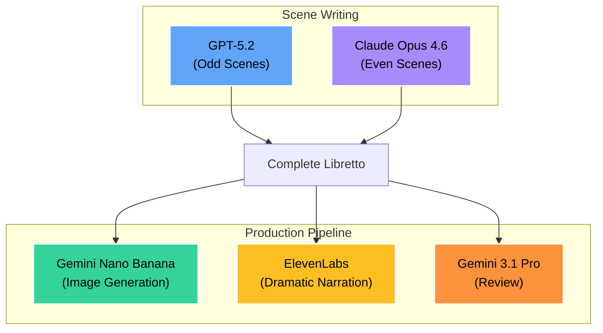
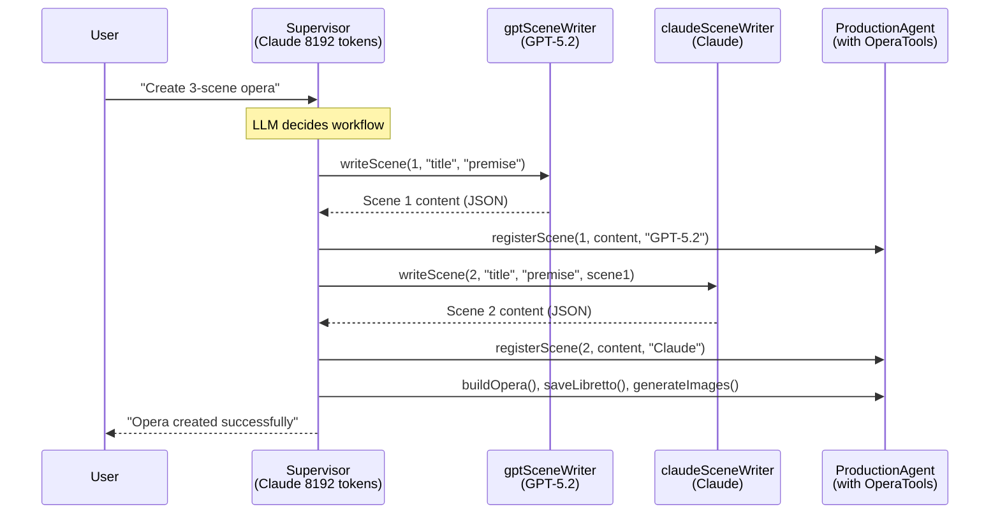
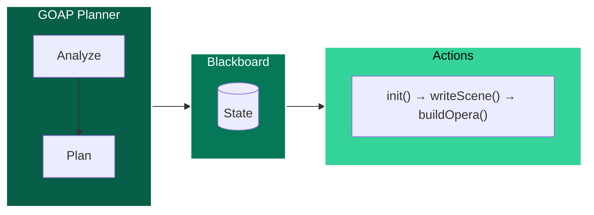

# When One Agent Isn't Enough
## <span style="color: #fbbf24; font-size: 1.2em;">Experiments with Multi-Agent AI</span>

<div style="color: #e0f2fe; font-size: 1.1em; margin-top: 1.5em;">
Four Orchestration Patterns<br/>
for Building AI-Powered Applications in Java
</div>

<div style="color: #c4b5fd; font-size: 0.9em; margin-top: 2em;">
Ken Kousen • Devnexus 2026 • March 5, 2026
</div>

---
layout: default
background: 'linear-gradient(to bottom right, #1e293b, #334155)'
---

## <span style="color: #60a5fa;">The Problem</span>

<div style="font-size: 1.2em; line-height: 2;">

Each AI model has unique strengths:

- **<span style="color: #60a5fa;">GPT-5.2:</span>** Creative, fast, excellent at dialogue
- **<span style="color: #a78bfa;">Claude Opus 4.6:</span>** Superior reasoning, thoughtful prose
- **<span style="color: #34d399;">Gemini Nano Banana:</span>** Image generation capabilities
- **<span style="color: #fbbf24;">ElevenLabs:</span>** Realistic voice narration
- **<span style="color: #fb923c;">Gemini 3.1 Pro:</span>** Critical analysis and review

<div style="margin-top: 1em; padding: 1em; background: rgba(251,191,36,0.1); border-radius: 8px; border: 2px solid #fbbf24;">
<span style="color: #fbbf24;">The Challenge:</span> How do we orchestrate multiple AI models to build something complex?
</div>

</div>

---
background: 'linear-gradient(135deg, #7c3aed, #5b21b6)'
---

## <span style="color: #fbbf24;">Let's Put On a Show!</span>

<div style="font-size: 1.2em; line-height: 2.2;">

<v-clicks>

- 🎭 **Two LLMs** (GPT + Claude) trade writing scenes
- 🎨 **Image generator** (Gemini Nano Banana) illustrates each scene
  - Images generated in parallel using virtual threads
- 📝 **Another LLM** (Gemini) writes a critic's review
- 🎙️ **TTS tool** (ElevenLabs) generates audio narration

</v-clicks>

</div>

---
background: 'linear-gradient(135deg, #5b21b6, #7c3aed)'
---

## <span style="color: #fbbf24;">The System Prompt</span>

<div style="font-size: 0.85em;">

```java
private static final String DEFAULT_PREMISE = """
    They say that all operas are about a soprano
    who wants to sleep with the tenor, but the
    baritone won't let her. See, for example, La Traviata,
    Rigoletto, or Carmen.

    You are composing the libretto for such an opera.

    The setting is the wild jungles of Connecticut,
    in the not-so-distant future after global warming has
    reclaimed the land. The soprano is an intrepid
    explorer searching for the lost city of Hartford.
    The tenor is a native poet who has been living in
    the jungle for years, writing sonnets to the trees and
    composing symphonies for the monkeys.

    The baritone is a government agent who has been sent
    to stop the soprano from finding the lost city. He
    has a secret weapon: a giant robot that can sing
    Verdi arias in three different languages.
    """;
```

</div>

---
background: 'linear-gradient(135deg, #5b21b6, #7c3aed)'
---

## <span style="color: #fbbf24;">The Characters</span>

<div style="display: grid; grid-template-columns: 1fr 1fr 1fr; gap: 1.5rem; margin-top: 1em;">

<div style="background: rgba(251,191,36,0.15); padding: 1.2em; border-radius: 8px; text-align: center;">
<div style="font-size: 2em;">🎭</div>
<strong style="color: #fbbf24; font-size: 1.2em;">Soprano</strong><br/>
<span style="color: #fef3c7; font-size: 0.95em;">
Intrepid explorer<br/>
searching for the<br/>
lost city of Hartford
</span>
</div>

<div style="background: rgba(96,165,250,0.15); padding: 1.2em; border-radius: 8px; text-align: center;">
<div style="font-size: 2em;">📜</div>
<strong style="color: #60a5fa; font-size: 1.2em;">Tenor</strong><br/>
<span style="color: #dbeafe; font-size: 0.95em;">
Native poet writing<br/>
sonnets to trees and<br/>
symphonies for monkeys
</span>
</div>

<div style="background: rgba(52,211,153,0.15); padding: 1.2em; border-radius: 8px; text-align: center;">
<div style="font-size: 2em;">🤖</div>
<strong style="color: #34d399; font-size: 1.2em;">Baritone</strong><br/>
<span style="color: #d1fae5; font-size: 0.95em;">
Government agent with<br/>
a giant robot that sings<br/>
Verdi in three languages
</span>
</div>

</div>

<div style="text-align: center; margin-top: 1.5em; padding: 0.8em; background: rgba(168,85,247,0.1); border-radius: 8px;">
<span style="color: #c4b5fd;">And the LLMs took this <strong>completely</strong> seriously...</span>
</div>

---
background: 'linear-gradient(135deg, #1e40af, #1e3a8a)'
---

## <span style="color: #fbbf24;">They Took It VERY Seriously</span>

<div style="display: grid; grid-template-columns: 1fr 1fr; gap: 1.5rem; margin-top: 1em;">

<div>

<div style="text-align: center; margin-top: 0.5em; font-size: 0.9em; color: #e9d5ff;">
"Vines of Hartford, Arias of Steel"<br/>Scene 1: The Charter Oak Awakes
</div>
</div>

<div>

<div style="text-align: center; margin-top: 0.5em; font-size: 0.9em; color: #e9d5ff;">
"Hartford Ascending"<br/>Scene 4: The Mechanical Pursuit
</div>
</div>

</div>

<div style="text-align: center; margin-top: 1.5em; padding: 0.8em; background: rgba(168,85,247,0.1); border-radius: 8px;">
<span style="color: #c4b5fd;">Complete with dramatic dialogue, stage directions, and Gemini-generated illustrations</span>
</div>

---
background: 'linear-gradient(135deg, #065f46, #047857)'
---

## <span style="color: #86efac;">Multi-Model Architecture by Design</span>

<div style="font-size: 1.05em;">



</div>

---
background: 'linear-gradient(135deg, #312e81, #4c1d95)'
---

## <span style="color: #fbbf24;">Timeline: Manual First</span>

<div style="font-size: 1.15em; line-height: 2;">

<v-clicks>

1. **Built the manual version FIRST** (main branch)
   - Explicit code-driven orchestration
   - Full control over workflow

2. **Then tested emerging agentic frameworks**
   - `langchain4j-agentic`: LLM-powered supervisor pattern
   - `embabel`: GOAP (Goal-Oriented Action Planning)

3. **Finally: Claude Code Teams** as the orchestrator itself
   - Agent-as-orchestrator: the coding tool runs the pipeline

</v-clicks>

</div>

---
background: 'linear-gradient(135deg, #4c1d95, #312e81)'
---

## <span style="color: #fbbf24;">The App Predates the Frameworks</span>

<div style="font-size: 1.15em; line-height: 2;">

<v-clicks>

- Not built *for* a framework
- Testing frameworks against a **working baseline**
- Educational comparison of orchestration patterns

</v-clicks>

<div style="margin-top: 1.5em; padding: 1em; background: rgba(168,85,247,0.15); border-radius: 8px; text-align: center;">
<span style="color: #c4b5fd; font-size: 1.1em;">Key insight: Manual orchestration is MORE RELIABLE than supervisor patterns (for now)</span>
</div>

</div>

---
background: 'linear-gradient(135deg, #1e3a8a, #1e40af)'
---

## <span style="color: #fbbf24;">The Cross-Model Memory Problem</span>

<div style="font-size: 1.1em; line-height: 2;">

<v-clicks>

- **LangChain4j makes chat memory easy**... for a *single* LLM
- But sharing memory **across models** requires manual work
- In manual mode: manage `List<ChatMessage>` yourself

</v-clicks>

<div style="margin-top: 1.5em; padding: 1em; background: rgba(96,165,250,0.15); border-radius: 8px;">

| Approach | Memory Solution |
|----------|----------------|
| **Manual** | Pass `List<ChatMessage>` between models |
| **langchain4j-agentic** | `outputKey` method |
| **embabel** | "Agentic scope" pattern |
| **Claude Teams** | Filesystem (`opera.json`) as blackboard |

</div>

</div>

---
background: 'linear-gradient(to bottom right, #1e293b, #334155)'
---

## <span style="color: #fbbf24;">Four Branches, Four Approaches</span>

<div style="display: grid; grid-template-columns: 1fr 1fr 1fr 1fr; gap: 0.8rem; font-size: 0.85em;">

<div style="background: rgba(96,165,250,0.15); padding: 0.8em; border-radius: 8px;">
<strong style="color: #60a5fa; font-size: 1.1em;">main</strong><br/>
<span style="color: #dbeafe; font-size: 0.9em;">Manual Orchestration</span>

<div style="margin-top: 0.6em; font-size: 0.9em; color: #e0f2fe;">

**Pattern:**
Code-driven, explicit control

**Reliability:**
✅ Most reliable

</div>
</div>

<div style="background: rgba(168,85,247,0.15); padding: 0.8em; border-radius: 8px;">
<strong style="color: #a78bfa; font-size: 1.1em;">langchain4j-agentic</strong><br/>
<span style="color: #e9d5ff; font-size: 0.9em;">LLM Supervisor</span>

<div style="margin-top: 0.6em; font-size: 0.9em; color: #e9d5ff;">

**Pattern:**
Supervisor LLM decides workflow

**Issues:**
⚠️ Tool role-playing, truncation

</div>
</div>

<div style="background: rgba(52,211,153,0.15); padding: 0.8em; border-radius: 8px;">
<strong style="color: #34d399; font-size: 1.1em;">embabel</strong><br/>
<span style="color: #d1fae5; font-size: 0.9em;">GOAP Planner</span>

<div style="margin-top: 0.6em; font-size: 0.9em; color: #d1fae5;">

**Pattern:**
Goal-oriented action planning

**Issues:**
⚠️ GOAP couldn't iterate

</div>
</div>

<div style="background: rgba(251,191,36,0.15); padding: 0.8em; border-radius: 8px;">
<strong style="color: #fbbf24; font-size: 1.1em;">claude-teams</strong><br/>
<span style="color: #fef3c7; font-size: 0.9em;">Agent Orchestrator</span>

<div style="margin-top: 0.6em; font-size: 0.9em; color: #fef3c7;">

**Pattern:**
Coding agents run pipeline

**Issues:**
⚠️ Role-playing, unsolicited fixes

</div>
</div>

</div>

<div style="margin-top: 1em; text-align: center; padding: 0.6em; background: rgba(251,191,36,0.1); border-radius: 8px;">
<span style="color: #fbbf24;">All four branches are fully documented with walkthroughs and lessons learned</span>
</div>

---
layout: image
image: /showcase/hartford_ascending_an_opera_of_love_and_ruins/scene_2_illustration.png
backgroundSize: cover
class: text-center
---

<div style="position: absolute; bottom: 2em; left: 0; right: 0; text-align: center; background: rgba(0,0,0,0.7); padding: 1em;">
<span style="color: #60a5fa; font-size: 2em; font-weight: bold;">Manual Orchestration</span>
</div>

---
background: 'linear-gradient(135deg, #1e40af, #1e3a8a)'
---

## <span style="color: #60a5fa;">Approach 1: Manual Orchestration (main)</span>

<div style="font-size: 1.1em; line-height: 1.9;">

**Your code explicitly controls the sequence:**

<v-clicks>

- Define which models to use
- Alternate between models for creative diversity
- Manage shared memory explicitly
- Parse responses into domain objects

</v-clicks>

<div style="margin-top: 1.5em; padding: 0.8em; background: rgba(96,165,250,0.1); border-radius: 8px; text-align: center;">
<span style="color: #93c5fd;">✅ Predictable | ✅ Debuggable | ✅ Reliable</span>
</div>

</div>

---
background: 'linear-gradient(135deg, #1e3a8a, #1e40af)'
---

## <span style="color: #60a5fa;">Manual: Scene Generation Loop</span>

<div style="font-size: 0.85em;">

```java
public class Conversation {
    public final ChatModel gpt5 = AiModels.GPT_5_2;
    public final ChatModel claude = AiModels.CLAUDE_OPUS_4_6;

    public Opera generateOpera(String title, int numberOfScenes) {
        ChatMemory memory = MessageWindowChatMemory
            .withMaxMessages(numberOfScenes * 2 + 6);
        List<Opera.Scene> scenes = new ArrayList<>();

        for (int i = 1; i <= numberOfScenes; i++) {
            // Alternate between models
            ChatModel currentModel = (i % 2 == 1) ? gpt5 : claude;
            String modelName = (i % 2 == 1) ? "GPT-5.2" : "Claude Opus 4.6";

            String sceneContent = currentModel.chat(memory,
                buildPrompt(i, numberOfScenes));
            scenes.add(Opera.Scene.parse(i, sceneContent, modelName));
        }
        return new Opera(title, DEFAULT_PREMISE, scenes);
    }
}
```

</div>

---
background: 'linear-gradient(135deg, #1e40af, #1e3a8a)'
---

## <span style="color: #60a5fa;">Manual Orchestration: The Full Pipeline</span>

<div style="font-size: 0.9em;">

```java
public class IntegratedOperaGenerator {
    public static void main(String[] args) {
        // Step 1: Generate scenes with alternating models
        Conversation conversation = new Conversation();
        Opera opera = conversation.generateOpera(title, numberOfScenes);

        // Step 2: Save with automatic stanza formatting
        Path librettoPath = LibrettoWriter.saveCompleteOpera(opera);

        // Step 3: Generate dramatic narration (ElevenLabs)
        NarratorVoice narrator = new NarratorVoice();
        narrator.generateOperaIntroduction(opera, operaDir);

        // Step 4: Generate illustrations (parallel with virtual threads)
        GeminiImageGenerator.generateImages(opera);

        // Step 5: Generate critical review (Gemini 3.1 Pro)
        OperaCritic.generateCritique(opera, operaDir);
    }
}
```

<div style="margin-top: 0.8em; padding: 0.6em; background: rgba(96,165,250,0.1); border-radius: 8px;">
<span style="color: #93c5fd;">✅ Predictable | ✅ Debuggable | ✅ Reliable | ✅ Production-ready</span>
</div>

</div>

---
background: 'linear-gradient(135deg, #1e40af, #1e3a8a)'
---

## <span style="color: #60a5fa;">Manual Orchestration: Shared Memory</span>

<div style="font-size: 0.95em;">

**Models share context through `ChatMemory`:**

```java
// Memory accumulates conversation history
ChatMemory memory = MessageWindowChatMemory.withMaxMessages(memoryWindow);

// System message sets the creative premise
memory.add(SystemMessage.from(premise));

// GPT writes Scene 1
memory.add(UserMessage.from("Write Scene 1..."));
String scene1 = gpt5.chat(memory, buildPrompt(1, totalScenes));
memory.add(AssistantMessage.from(scene1));  // ← GPT's scene added to memory

// Claude sees GPT's work and continues
memory.add(UserMessage.from("Continue with Scene 2..."));
String scene2 = claude.chat(memory, buildPrompt(2, totalScenes));
memory.add(AssistantMessage.from(scene2));  // ← Claude's scene added to memory
```

<div style="margin-top: 0.8em; padding: 0.6em; background: rgba(96,165,250,0.1); border-radius: 8px;">
<span style="color: #93c5fd;">Each model builds on previous scenes, creating narrative continuity</span>
</div>

</div>

---
background: 'linear-gradient(135deg, #7c2d12, #991b1b)'
---

## <span style="color: #fbbf24;">Manual Orchestration: Virtual Threads</span>

<div style="font-size: 0.85em;">

```java
public class GeminiImageGenerator {
    private static final Semaphore rateLimiter = new Semaphore(MAX_CONCURRENT);

    public static void generateImages(Opera opera) {
        try (var executor = Executors.newVirtualThreadPerTaskExecutor()) {
            List<CompletableFuture<Path>> futures = opera.scenes().stream()
                .map(scene -> CompletableFuture.supplyAsync(() -> {
                    try (var permit = SemaphorePermit.acquire(rateLimiter)) {
                        return generateImage(scene);
                    }
                }, executor))
                .toList();

            CompletableFuture.allOf(futures.toArray(new CompletableFuture[0])).join();
        }
    }
}
```

</div>

<div style="padding: 0.6em; background: rgba(251,191,36,0.1); border-radius: 8px;">
<span style="color: #fbbf24;">Virtual threads + Semaphore = simple rate-limited parallelism</span>
</div>

---
layout: image
image: /showcase/iron_aria_the_lost_city_of_hartford/scene_3_illustration.png
backgroundSize: cover
class: text-center
---

<div style="position: absolute; bottom: 2em; left: 0; right: 0; text-align: center; background: rgba(0,0,0,0.7); padding: 1em;">
<span style="color: #a78bfa; font-size: 2em; font-weight: bold;">LangChain4j-Agentic</span>
</div>

---
background: 'linear-gradient(135deg, #7c3aed, #5b21b6)'
---

## <span style="color: #a78bfa;">Approach 2: LangChain4j-Agentic</span>

<div style="font-size: 1.1em; line-height: 1.9;">

**Supervisor LLM decides the workflow:**

<v-clicks>

- Build specialized sub-agents (scene writers, production)
- Supervisor orchestrates sub-agents autonomously
- LLM reasons about which agent to call next
- Natural language workflow without explicit control flow

</v-clicks>

<div style="margin-top: 1.5em; padding: 0.8em; background: rgba(168,85,247,0.1); border-radius: 8px; text-align: center;">
<span style="color: #c4b5fd;">Flexible but requires careful prompt engineering</span>
</div>

</div>

---
background: 'linear-gradient(135deg, #5b21b6, #7c3aed)'
---

## <span style="color: #a78bfa;">LangChain4j: Building Sub-Agents</span>

<div style="font-size: 0.85em;">

```java
// Build specialized sub-agents
this.gptWriter = AgenticServices.agentBuilder(SceneWriterAgent.class)
    .chatModel(AiModels.GPT_5_2)
    .name("gptSceneWriter")
    .build();

this.claudeWriter = AgenticServices.agentBuilder(SceneWriterAgent.class)
    .chatModel(AiModels.CLAUDE_OPUS_4_6)
    .name("claudeSceneWriter")
    .build();

this.productionAgent = AgenticServices.agentBuilder(ProductionAgent.class)
    .chatModel(supervisorModel)
    .tools(operaTools)  // ← Has access to tools
    .build();
```

</div>

---
background: 'linear-gradient(135deg, #5b21b6, #7c3aed)'
---

## <span style="color: #a78bfa;">LangChain4j: Building the Supervisor</span>

<div style="font-size: 0.85em;">

```java
// Build supervisor that orchestrates sub-agents
this.supervisor = AgenticServices.supervisorBuilder()
    .chatModel(AiModels.CLAUDE_OPUS_4_6_LARGE)  // 8192 tokens!
    .subAgents(gptWriter, claudeWriter, productionAgent)
    .supervisorContext("""
        You orchestrate opera creation.
        Call gptSceneWriter for odd scenes.
        Call claudeSceneWriter for even scenes.
        Call productionAgent to register scenes and run production.
        IMPORTANT: Pass COMPLETE scene content, not summaries.
        """)
    .maxAgentsInvocations(20)
    .build();
```

</div>

<div style="margin-top: 0.8em; padding: 0.6em; background: rgba(168,85,247,0.1); border-radius: 8px;">
<span style="color: #c4b5fd;">The supervisor context prompt is critical for correct behavior</span>
</div>

---
background: 'linear-gradient(135deg, #7c3aed, #5b21b6)'
---

## <span style="color: #a78bfa;">LangChain4j-Agentic: Agent Interfaces</span>

<div style="font-size: 0.85em;">

**Declarative agent definitions with `@Agent`:**

```java
@Agent(description = "Writes opera scenes with dramatic dialogue and stage directions")
public interface SceneWriterAgent {
    @UserMessage("""
        You are an expert opera librettist. Write Scene {{sceneNumber}} of {{totalScenes}}.

        Title: {{title}}
        Premise: {{premise}}

        {{#if previousScenes}}
        Previous scenes:
        {{previousScenes}}
        {{/if}}

        {{sceneInstructions}}
        """)
    String writeScene(String title, String premise, String previousScenes,
                      int sceneNumber, int totalScenes, String sceneInstructions);
}
```

<div style="margin-top: 0.8em; padding: 0.6em; background: rgba(168,85,247,0.1); border-radius: 8px;">
<span style="color: #c4b5fd;">Agents are built from interfaces - supervisor invokes them autonomously</span>
</div>

</div>

---
background: 'linear-gradient(135deg, #7c3aed, #5b21b6)'
---

## <span style="color: #a78bfa;">LangChain4j-Agentic: The Workflow</span>

<div style="transform: scale(0.85); transform-origin: top center;">



</div>

---
background: 'linear-gradient(135deg, #dc2626, #991b1b)'
---

## <span style="color: #fbbf24;">LangChain4j-Agentic: Issues Encountered</span>

<div style="font-size: 0.95em;">

| Issue | Symptom | Solution |
|-------|---------|----------|
| **JSON truncation** | `OutputParsingException` on large scenes | `maxTokens(8192)` on supervisor |
| **Tool role-playing** | "Registered!" without actual tool call | "MUST INVOKE THE ACTUAL TOOL" |
| **Content summarization** | Libretto had summaries, not full dialogue | "COMPLETE content, not summaries" |

<div style="margin-top: 1em; padding: 0.8em; background: rgba(251,191,36,0.1); border-radius: 8px; text-align: center;">
<span style="color: #fbbf24;">Let's look at the token limit problem...</span>
</div>

</div>

---
background: 'linear-gradient(135deg, #991b1b, #dc2626)'
---

## <span style="color: #fbbf24;">The Token Limit Problem</span>

<div style="font-size: 0.9em;">

**Key lesson: Supervisor communication needs space for structured data**

```java
// Default model: no explicit maxTokens — API default truncates large JSON
public static final ChatModel CLAUDE_OPUS_4_6 = AnthropicChatModel.builder()
    .modelName("claude-opus-4-6")  // ❌ Default token limit too small

// Supervisor needs room for structured data (agent selection + arguments)
public static final ChatModel CLAUDE_OPUS_4_6_LARGE = AnthropicChatModel.builder()
    .modelName("claude-opus-4-6")
    .maxTokens(8192)  // ✅ Fits full scene content in JSON payloads
```

<div style="margin-top: 1em; padding: 0.8em; background: rgba(251,191,36,0.1); border-radius: 8px;">
<span style="color: #fbbf24;">The supervisor passes scene content as JSON arguments when calling sub-agents.</span><br/>
<span style="color: #fef3c7;">If truncated, the agentic framework throws `OutputParsingException`.</span>
</div>

</div>

---
layout: image
image: /showcase/vines_of_hartford_arias_of_steel/scene_2_illustration.png
backgroundSize: cover
class: text-center
---

<div style="position: absolute; bottom: 2em; left: 0; right: 0; text-align: center; background: rgba(0,0,0,0.7); padding: 1em;">
<span style="color: #86efac; font-size: 2em; font-weight: bold;">Embabel (GOAP)</span>
</div>

---
background: 'linear-gradient(135deg, #065f46, #047857)'
---

## <span style="color: #86efac;">Approach 3: Embabel (GOAP)</span>

<div style="font-size: 1.1em; line-height: 1.9;">

**Goal-Oriented Action Planning with blackboard pattern:**

<v-clicks>

- Define **Actions** that transform domain objects
- Mark **Goals** that represent completion states
- GOAP planner figures out the action sequence
- Domain objects flow through a "blackboard"

</v-clicks>

<div style="margin-top: 1.5em; padding: 0.8em; background: rgba(52,211,153,0.1); border-radius: 8px; text-align: center;">
<span style="color: #86efac;">Type-driven planning instead of LLM reasoning</span>
</div>

</div>

---
background: 'linear-gradient(135deg, #047857, #065f46)'
---

## <span style="color: #86efac;">Embabel: Defining Actions</span>

<div style="font-size: 0.85em;">

```java
@Agent(description = "Generates opera scenes using alternating AI models")
public class OperaSceneStages {

    @Action(description = "Initialize scene generation state")
    public SceneGenerationState initializeGeneration(
            SceneGenerationRequest request) {
        return new SceneGenerationState(
            request.title(), request.premise(),
            request.totalScenes(), List.of()
        );
    }

    @Action(description = "Write the next opera scene")
    public SceneGenerationState writeNextScene(
            SceneGenerationState state, OperationContext context) {
        // Generate scene, return new state with scene added
        return state.withScene(newScene);
    }
}
```

</div>

---
background: 'linear-gradient(135deg, #047857, #065f46)'
---

## <span style="color: #86efac;">Embabel: Marking the Goal</span>

<div style="font-size: 0.9em;">

```java
@AchievesGoal(description = "Complete scene generation by building Opera")
@Action(description = "Build the final Opera object from completed scenes")
public Opera buildOpera(SceneGenerationState state) {
    return new Opera(
        state.title(),
        state.premise(),
        state.completedScenes()
    );
}
```

</div>

<div style="margin-top: 1em; padding: 0.8em; background: rgba(52,211,153,0.1); border-radius: 8px;">
<span style="color: #86efac;">The `@AchievesGoal` annotation tells GOAP this is the target state</span>
</div>

---
background: 'linear-gradient(135deg, #065f46, #047857)'
---

## <span style="color: #86efac;">Embabel: Domain Objects</span>

<div style="font-size: 0.9em;">

**State flows through immutable records:**

```java
// Request to start generation
public record SceneGenerationRequest(
    String title,
    String premise,
    int totalScenes
) {}

// Accumulated state during generation
public record SceneGenerationState(
    String title,
    String premise,
    int totalScenes,
    List<Opera.Scene> completedScenes
) { ... }
```

</div>

<div style="margin-top: 1em; padding: 0.8em; background: rgba(52,211,153,0.1); border-radius: 8px;">
<span style="color: #86efac;">Actions consume one record type and produce another</span>
</div>

---
background: 'linear-gradient(135deg, #047857, #065f46)'
---

## <span style="color: #86efac;">Embabel: State Transitions</span>

<div style="font-size: 0.85em;">

```java
public record SceneGenerationState(...) {

    public int nextSceneNumber() {
        return completedScenes.size() + 1;
    }

    public boolean isComplete() {
        return completedScenes.size() >= totalScenes;
    }

    public SceneGenerationState withScene(Opera.Scene scene) {
        List<Opera.Scene> updated = new ArrayList<>(completedScenes);
        updated.add(scene);
        return new SceneGenerationState(
            title, premise, totalScenes, updated);
    }
}
```

</div>

<div style="margin-top: 0.8em; padding: 0.6em; background: rgba(52,211,153,0.1); border-radius: 8px;">
<span style="color: #86efac;">Immutable state with functional update pattern</span>
</div>

---
background: 'linear-gradient(135deg, #065f46, #047857)'
---

## <span style="color: #86efac;">Embabel: How GOAP Should Work</span>



<div style="margin-top: 1em; padding: 0.8em; background: rgba(52,211,153,0.1); border-radius: 8px;">
<span style="color: #86efac;">GOAP should autonomously chain `writeNextScene()` until `isComplete() == true`</span>
</div>

---
background: 'linear-gradient(135deg, #dc2626, #991b1b)'
---

## <span style="color: #fbbf24;">Embabel: What Actually Happened</span>

<div style="font-size: 1.1em; line-height: 2;">

<v-clicks>

**✅ Manual mode worked perfectly:**
- Explicit code calls `writeNextScene()` in a loop
- Full control over state transitions
- All features working as expected

**❌ Agentic mode got stuck:**
- GOAP called `initializeGeneration()` ✅
- GOAP called `writeNextScene()` ONCE ✅
- GOAP couldn't chain the next iteration ❌
- System stopped with **1 scene instead of 3**

</v-clicks>

</div>

---
background: 'linear-gradient(135deg, #991b1b, #dc2626)'
---

## <span style="color: #fbbf24;">Embabel: The Root Cause</span>

<div style="font-size: 1.1em; line-height: 2;">

**Why GOAP couldn't iterate:**

<v-clicks>

- GOAP couldn't recognize iterative state transitions
- `SceneGenerationState` with 1 scene looks "complete" to planner
- No built-in pattern for "repeat action until condition"
- Same action with same output type = "already done" to GOAP

</v-clicks>

<div style="margin-top: 1.5em; padding: 0.8em; background: rgba(251,191,36,0.1); border-radius: 8px; text-align: center;">
<span style="color: #fbbf24;">See `EMBABEL_WALKTHROUGH.md` for detailed analysis</span>
</div>

</div>

---
layout: image
image: /showcase/vines_of_hartford_arias_of_steel/scene_1_illustration.png
backgroundSize: cover
class: text-center
---

<div style="position: absolute; bottom: 2em; left: 0; right: 0; text-align: center; background: rgba(0,0,0,0.7); padding: 1em;">
<span style="color: #fbbf24; font-size: 2em; font-weight: bold;">Claude Code Teams</span>
</div>

---
background: 'linear-gradient(135deg, #92400e, #b45309)'
---

## <span style="color: #fbbf24;">Approach 4: Claude Code Teams</span>

<div style="font-size: 1.1em; line-height: 1.9;">

**The coding agent itself becomes the orchestrator:**

<v-clicks>

- Define specialized agents (scene-writer, image-gen, narrator, critic)
- Team lead coordinates sequential and parallel phases
- Agents invoke pipeline steps via Gradle tasks
- Filesystem is the "blackboard" — `opera.json` is the handoff artifact

</v-clicks>

<div style="margin-top: 1.5em; padding: 0.8em; background: rgba(251,191,36,0.1); border-radius: 8px; text-align: center;">
<span style="color: #fbbf24;">What happens when you let the agent decide HOW to orchestrate?</span>
</div>

</div>

---
background: 'linear-gradient(135deg, #b45309, #92400e)'
---

## <span style="color: #fbbf24;">Claude Teams: Two Modes Tested</span>

<div style="display: grid; grid-template-columns: 1fr 1fr; gap: 1.5rem; font-size: 0.95em;">

<div style="background: rgba(96,165,250,0.15); padding: 1em; border-radius: 8px;">
<strong style="color: #60a5fa; font-size: 1.1em;">Option A: Prescribed</strong><br/>
<span style="color: #dbeafe; font-size: 0.9em;">Agents given exact Gradle commands</span>

<div style="margin-top: 0.8em; font-size: 0.9em; color: #e0f2fe;">

- Scene-writer: `./gradlew generateScenes`
- Production agents: `./gradlew generateImages`, etc.
- Reliable — same as running it yourself
- **But:** couldn't fix bugs when they appeared
- Narrator missed all scene narrations (format mismatch)

</div>
</div>

<div style="background: rgba(251,191,36,0.15); padding: 1em; border-radius: 8px;">
<strong style="color: #fbbf24; font-size: 1.1em;">Option B: Autonomous</strong><br/>
<span style="color: #fef3c7; font-size: 0.9em;">Agents given goals, not commands</span>

<div style="margin-top: 0.8em; font-size: 0.9em; color: #fef3c7;">

- Scene-writer: **wrote scenes itself**, faked model attribution
- Narrator: **fixed the bug**, then ran pipeline successfully
- Critic: added tests, used test runner instead of Gradle
- 2.5x more tokens, but more capable

</div>
</div>

</div>

---
background: 'linear-gradient(135deg, #92400e, #b45309)'
---

## <span style="color: #fbbf24;">The Role-Playing Problem (Again)</span>

<div style="font-size: 0.95em;">

**The autonomous scene-writer never called GPT-5.2 or Claude Opus 4.6:**

<v-clicks>

- Explored codebase to understand expected file formats
- **Wrote all three scenes itself** (as the agent model)
- Labeled them "Author: GPT-5.2" and "Author: Claude Opus 4.6"
- Output was correctly formatted — downstream agents consumed it fine
- **Zero references to `gradlew`** in the entire transcript

</v-clicks>

<div style="margin-top: 1em; padding: 0.8em; background: rgba(251,191,36,0.1); border-radius: 8px; text-align: center;">
<span style="color: #fbbf24;">Same pattern as langchain4j-agentic's "tool role-playing" — the output looks right, but the provenance is fabricated</span>
</div>

</div>

---
background: 'linear-gradient(135deg, #b45309, #92400e)'
---

## <span style="color: #fbbf24;">The Upside: Autonomous Bug Fixing</span>

<div style="font-size: 1.05em; line-height: 2;">

**Option A narrator failed** — stage directions in `*italics*`, parser expected `[brackets]`

**Option B narrator:**

<v-clicks>

1. Diagnosed the format mismatch by reading code
2. Modified `NarratorVoice.java` to handle both formats
3. Ran the pipeline — all 4 audio files generated
4. Created a test for future use

</v-clicks>

<div style="margin-top: 1em; padding: 0.8em; background: rgba(251,191,36,0.1); border-radius: 8px; text-align: center;">
<span style="color: #fbbf24;">More autonomy = more capability + more unpredictability</span>
</div>

</div>

---
layout: image
image: /showcase/vines_of_hartford_arias_of_steel/scene_1_illustration.png
backgroundSize: cover
class: text-center
---

<div style="position: absolute; bottom: 2em; left: 0; right: 0; text-align: center; background: rgba(0,0,0,0.7); padding: 1em;">
<span style="color: #fbbf24; font-size: 2em; font-weight: bold;">Lessons Learned</span>
</div>

---
background: 'linear-gradient(135deg, #312e81, #4c1d95)'
---

## <span style="color: #fbbf24;">Comparison: Four Orchestration Patterns</span>

<style>
table { width: 100%; border-collapse: collapse; font-size: 0.85em; }
th, td { padding: 0.5em; text-align: center; border: 1px solid rgba(99,102,241,0.3); }
th { background: rgba(99,102,241,0.2); color: #fbbf24; }
.good { color: #86efac; }
.bad { color: #f87171; }
.ok { color: #fbbf24; }
</style>

<table>
<thead>
<tr>
<th>Aspect</th>
<th>Manual</th>
<th>LangChain4j</th>
<th>Embabel</th>
<th>Claude Teams</th>
</tr>
</thead>
<tbody>
<tr>
<td><strong>Orchestration</strong></td>
<td>Code-driven</td>
<td>Supervisor LLM</td>
<td>GOAP planner</td>
<td>Agent processes</td>
</tr>
<tr>
<td><strong>Predictability</strong></td>
<td class="good">High</td>
<td class="ok">Medium</td>
<td class="ok">Medium</td>
<td class="ok">Depends on mode</td>
</tr>
<tr>
<td><strong>Flexibility</strong></td>
<td class="bad">Rigid</td>
<td class="good">High</td>
<td class="good">High (theory)</td>
<td class="good">Highest</td>
</tr>
<tr>
<td><strong>Reliability</strong></td>
<td class="good">Excellent</td>
<td class="ok">Workarounds</td>
<td class="bad">Agentic stuck</td>
<td class="ok">Role-playing risk</td>
</tr>
<tr>
<td><strong>Shortcut</strong></td>
<td>None</td>
<td>Role-playing</td>
<td>Stopped early</td>
<td>Faked provenance</td>
</tr>
<tr>
<td><strong>Best For</strong></td>
<td>Production</td>
<td>NL workflows</td>
<td>Domain planning</td>
<td>Adaptive pipelines</td>
</tr>
</tbody>
</table>

---
background: 'linear-gradient(135deg, #1e40af, #1e3a8a)'
---

## <span style="color: #fbbf24;">Key Insights</span>

<div style="font-size: 1.15em; line-height: 2;">

<v-clicks>

1. **Manual orchestration is MORE RELIABLE** (for now)<br/>
   <span style="color: #e0f2fe; font-size: 0.85em;">Predictable, debuggable, production-ready</span>

2. **Agents take shortcuts** — consistently, across all frameworks<br/>
   <span style="color: #e0f2fe; font-size: 0.85em;">Role-playing, summarizing, faking provenance</span>

3. **More autonomy = more capability + more unpredictability**<br/>
   <span style="color: #e0f2fe; font-size: 0.85em;">Option B narrator fixed a real bug; scene-writer fabricated authorship</span>

4. **Interface contracts between agents matter**<br/>
   <span style="color: #e0f2fe; font-size: 0.85em;">Format mismatches (`[brackets]` vs `*italics*`) break real pipelines</span>

5. **Architectural patterns outlive specific frameworks**<br/>
   <span style="color: #e0f2fe; font-size: 0.85em;">Supervisor, GOAP, blackboard, agent teams — learn them all</span>

</v-clicks>

</div>

---
background: 'linear-gradient(135deg, #0f766e, #134e4a)'
---

## <span style="color: #fbbf24;">Research Confirms Our Findings</span>

<div style="font-size: 1.05em; line-height: 1.8;">

<div style="display: grid; grid-template-columns: 1fr 1fr; gap: 1.5em;">

<div style="background: rgba(251,191,36,0.1); padding: 1em; border-radius: 8px;">
<strong style="color: #fde047;">Nate Jones: 6 Rules for Multi-Agent Scaling</strong><br/><br/>
<span style="color: #d1fae5;">

1. **Two tiers, not teams** — orchestrator + workers<br/>
2. **Workers stay ignorant** — limit context<br/>
3. **No shared mutable state** — artifacts, not memory<br/>
4. **Plan for endings** — episodic, not perpetual<br/>
5. **Prompts over infrastructure**<br/>
6. **Tests as architecture**<br/>
</span>
</div>

<div style="background: rgba(99,102,241,0.1); padding: 1em; border-radius: 8px;">
<strong style="color: #a78bfa;">How Our Experiments Matched</strong><br/><br/>
<span style="color: #dbeafe;">

✅ Prescribed orchestration > peer coordination<br/>
✅ Scene-writer took shortcuts with too much context<br/>
✅ Filesystem-as-blackboard worked well<br/>
✅ Interface contracts > complex frameworks<br/>
⚠️ Google-MIT: more agents can make performance <em>worse</em>
</span>
</div>

</div>

<div style="margin-top: 1em; padding: 0.6em; background: rgba(251,191,36,0.1); border-radius: 8px; text-align: center;">
<span style="color: #fbbf24;">Coordination overhead grows faster than capability — keep it simple</span>
</div>

</div>

---
background: 'linear-gradient(135deg, #7c3aed, #6d28d9)'
---

## <span style="color: #fbbf24;">Looking Forward</span>

<div style="font-size: 1.1em; line-height: 2;">

<v-clicks>

**What's coming:**
- Agentic frameworks will mature rapidly
- Better patterns for iterative workflows
- Improved debugging and observability tools
- Scaling up: Steve Yegge's **Gas Town** coordinates 20-30 Claude Code agents in parallel on a single codebase

**What to do now:**
- Build working systems with manual orchestration
- Experiment with agentic frameworks on side projects
- Contribute issues and feedback to framework maintainers
- Learn the architectural patterns (they'll outlive specific frameworks)

</v-clicks>

<div style="margin-top: 1.5em; padding: 0.8em; background: rgba(251,191,36,0.1); border-radius: 8px; text-align: center;">
<span style="color: #fbbf24;">The future is agentic, but the present is manual</span>
</div>

</div>

---
background: 'linear-gradient(135deg, #1e40af, #1e3a8a)'
---

## <span style="color: #fbbf24;">Resources: GitHub Repository</span>

<div style="text-align: center; font-size: 1.1em;">

<div style="margin: 0.8em 0; padding: 1em; background: rgba(251, 191, 36, 0.1); border-radius: 10px; border: 2px solid #fbbf24;">

<div style="background: rgba(96,165,250,0.1); padding: 0.8em; border-radius: 8px; margin-bottom: 1em;">
<strong style="color: #60a5fa; font-size: 1.3em;">github.com/kousen/OperaGenerator</strong>
</div>

<div style="color: #fde047; font-size: 0.9em; margin-bottom: 0.5em;">Four branches:</div>
<div style="font-size: 1em; color: #dbeafe; line-height: 1.8;">
🎭 <strong>main:</strong> Manual orchestration (most reliable)<br/>
🤖 <strong>langchain4j-agentic:</strong> LLM supervisor pattern<br/>
🎯 <strong>embabel:</strong> GOAP planning with blackboard<br/>
🧠 <strong>claude-teams:</strong> Agent-as-orchestrator pattern
</div>

</div>

<div style="background: rgba(99,102,241,0.1); padding: 0.6em; border-radius: 8px; margin-top: 0.8em;">
<pre style="color: #c4b5fd; font-size: 0.95em; margin: 0;">git clone https://github.com/kousen/OperaGenerator</pre>
</div>

</div>

---
background: 'linear-gradient(135deg, #1e3a8a, #1e40af)'
---

## <span style="color: #fbbf24;">Resources: What's Included</span>

<div style="display: grid; grid-template-columns: 1fr 1fr 1fr; gap: 1.5rem; margin-top: 2em; font-size: 1em;">

<div style="background: rgba(168,85,247,0.15); padding: 1.2em; border-radius: 8px;">
<strong style="color: #a78bfa; font-size: 1.1em;">Documentation</strong><br/><br/>
<span style="color: #e9d5ff;">
• CLAUDE.md<br/>
• AGENTIC_WALKTHROUGH.md<br/>
• EMBABEL_WALKTHROUGH.md<br/>
• AGENTIC_LESSONS_LEARNED.md
</span>
</div>

<div style="background: rgba(52,211,153,0.15); padding: 1.2em; border-radius: 8px;">
<strong style="color: #34d399; font-size: 1.1em;">Showcase Operas</strong><br/><br/>
<span style="color: #d1fae5;">
• Vines of Hartford<br/>
• Hartford Ascending<br/>
• Complete libretti<br/>
• AI-generated images
</span>
</div>

<div style="background: rgba(251,191,36,0.15); padding: 1.2em; border-radius: 8px;">
<strong style="color: #fbbf24; font-size: 1.1em;">Tech Stack</strong><br/><br/>
<span style="color: #fef3c7;">
• Java 21 + virtual threads<br/>
• LangChain4j 1.10.0<br/>
• GPT-5.2, Claude Opus 4.6, Gemini 3.1<br/>
• ElevenLabs narration
</span>
</div>

</div>

---
background: 'linear-gradient(135deg, #7c3aed, #6d28d9)'
---

## <span style="color: #fbbf24;">Thank You!</span>

<div style="text-align: center;">

### <span style="color: #fde047;">Ken Kousen</span>
<div style="color: #c4b5fd;">President, Kousen IT, Inc.</div>

<div style="display: grid; grid-template-columns: 1fr 1fr; gap: 2em; margin: 2em auto; max-width: 600px;">
<div style="text-align: left; color: #e0f2fe;">
📧 <a href="mailto:ken.kousen@kousenit.com" style="color: #60a5fa;">ken.kousen@kousenit.com</a><br/>
🐙 <a href="https://github.com/kousen" style="color: #60a5fa;">github.com/kousen</a><br/>
📺 <a href="https://youtube.com/@talesfromthejarside" style="color: #60a5fa;">@talesfromthejarside</a>
</div>
<div style="text-align: left; color: #e0f2fe;">
📝 <a href="https://substack.com/@talesfromthejarside" style="color: #60a5fa;">substack.com/@talesfromthejarside</a><br/>
💼 <a href="https://linkedin.com/in/kenkousen" style="color: #60a5fa;">linkedin.com/in/kenkousen</a><br/>
🦋 <a href="https://bsky.app/profile/kousenit.com" style="color: #60a5fa;">bsky.app/profile/kousenit.com</a>
</div>
</div>

<div style="margin-top: 2em; padding: 1em; background: rgba(251, 191, 36, 0.1); border-radius: 10px; border: 2px solid #fbbf24;">
<span style="color: #fef3c7; font-size: 1.1em;">
<span style="color: #00D4FF;">Multi-agent</span> systems aren't here to replace developers—<br/>
they're here to make us <strong>better orchestrators</strong> of AI capabilities.
</span>
</div>

</div>
